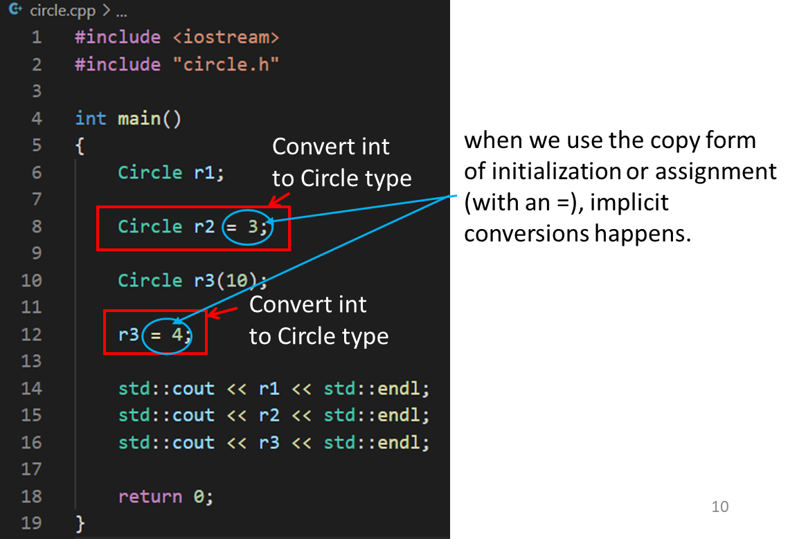
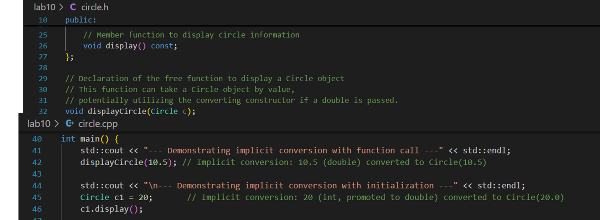
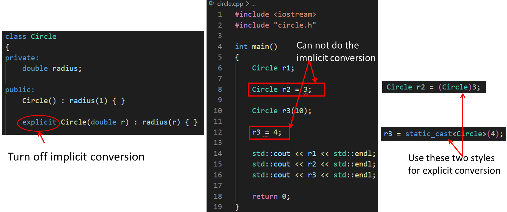
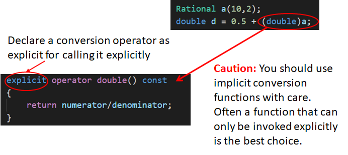
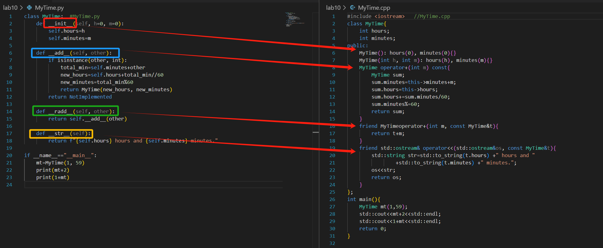
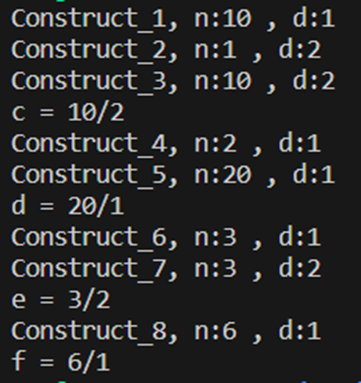
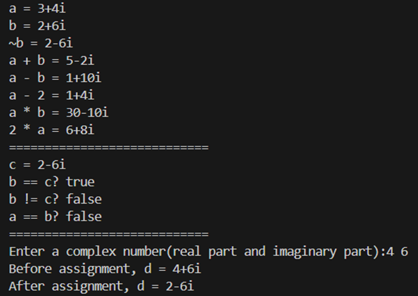
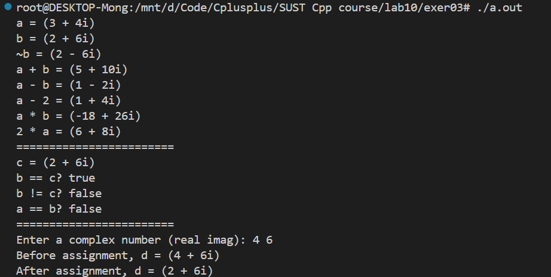

> [!TIP]
>
> Welcome to my CS205 lecture notes! Because the lecture is not in English, I will try my best to translate it.
>
> And at the same time, the `PPT`,`lab-file` also use the English,I will write **the English notes but not all.**

>[!NOTE]
>
>If you have a passion to konw more about the course, you can click the link below to learn more about the course.
>Read the repo.
>
>::github{repo="MongxinChan/CPP"}

> [!IMPORTANT]
>
> 由于本文篇幅过长，个人会添加适当的中文注解在里面。

## Topic Overview

- **Operator Overloading in C++**:
    - Member function vs. Non-member function (e.g., Friend function)
    - Returning object vs. Returning reference
- **Conversion of Class Types**:
    - Implicit conversion vs. explicit conversion
    - Conversion function
- **‘Operator Overloading’ in Python**:
    - `x + y` : `type(x).__add__(x, y)`
    - `x + y`: `type(y).__radd__(y, x)`
    - `__str__()`
- **Exercises**

## Foreword

Welcome to the Lab 10 study notes! This lab primarily delves into operator overloading for classes in C++, including how to define operator functions, the choice between member functions and non-member functions (especially friend functions), and considerations for return types (object or reference). We will also study class type conversion mechanisms, including implicit conversions, explicit conversions, and conversion functions. Finally, we will briefly compare operator overloading methods in Python.

#  Operator Overlo

Operator overloading allows us to redefine or "overload" the behavior of most C++ built-in operators for objects of user-defined class types. This means we can make operators work in a way that is logical and intuitive for our classes.

## 1.1 Operator Functions

To overload an operator, a special function form called an **operator function** is used. Its general syntax is:

```cpp
return_type operator op(argument-list)
```

where `op` is the operator symbol being overloaded (e.g., `+`, `-`, `*`, `<<`).

> ~~实际上，op是原皮，所以Genshin impact launch！！~~

**Rules and Considerations**:

- An operator function must either be a member function of a class or have at least one parameter of a class type (or a reference/pointer to a class type).
- The following operators **CANNOT** be overloaded: `.` (member access), `.*` (member pointer access), `::` (scope resolution), `sizeof`, `?:` (conditional operator), `typeid`.
- You **CANNOT** change the <u>**precedence, associativity, or arity (number of operands) of an operator.**</u>
- At least one operand must be of a user-defined type (i.e., you cannot overload operators for two built-in types).
- Certain operators (like assignment `=`, subscript `[]`, call `()`, member access arrow `->`) must be overloaded <u>**as member functions**</u>.
- Input/output operators (`<<`, `>>`) are typically overloaded as non-member friend functions to allow the left operand to **<u>be an `ostream` or `istream` object</u>**.

## 1.2 Member Function vs. Non-member Function (Friend Function)

The choice of implementing an operator function as a member function or a non-member function (often a friend function) depends on the specific situation:

- **Member Functions**:

    - Typically used when the left operand of the operator is an object of that class.
    - Unary operators are often implemented as member functions (with no parameters).
    - When a binary operator is a member function, the left operand is the calling object (`*this`), and the right operand is the function's single argument.
    - Assignment (`=`), subscript (`[]`), function call (`()`), and member access (`->`) operators **must** be member functions.

- **Non-member Functions (Often Friend Functions)**:

    - Used when the left operand of the operator is not an object of that class, or when type conversion is desired for the left operand.
    - For example, to overload `operator+` to support `MyClass obj; int_val + obj;`, if `int_val` needs to be converted to `MyClass` type, `operator+` must be a non-member function.
    - Input/output operators (`<<`, `>>`) must be non-member functions because their left operand is `std::ostream&` or `std::istream&`. If they need to access private members of the class, they should be declared as friends.
    - If a non-member operator function needs to access `private` or `protected` members of a class, it should be declared as a **friend** of that class.

    ```cpp
    // Member function example (operator+=)
    class MyNumber {
        int value;
    public:
        MyNumber(int v = 0) : value(v) {}
        MyNumber& operator+=(const MyNumber& rhs) {
            this->value += rhs.value;
            return *this;
        }
        friend std::ostream& operator<<(std::ostream& os, const MyNumber& num); // Friend declaration
    };
    
    // Non-member friend function example (operator<<)
    std::ostream& operator<<(std::ostream& os, const MyNumber& num) {
        os << num.value;
        return os;
    }
    ```

## 1.3 Returning Object vs. Returning Reference

The return type of an operator function is important and affects efficiency and usage.

- **Returning an Object (by Value)**:

    - When the operator's result is a new, independent object (e.g., `operator+` usually produces a new sum), it should be returned by value.

    - **Example**:

        ```cpp
        Complex Complex::operator+(const Complex& rhs) const {
            Complex result;
            result.real = this->real + rhs.real;
            result.imag = this->imag + rhs.imag;
            return result; // Returns a new Complex object
        }
        ```

        `[Complex class operator+ returning an object code]`

    - **Drawback**: Returning an object creates a temporary object and invokes the copy constructor (unless the compiler applies Return Value Optimization - RVO or NRVO), which can have an efficiency cost.

    - **Return Value Optimization (RVO/NRVO)**: Modern compilers are often able to optimize away the creation of this temporary object, constructing the result object directly in the memory location provided by the caller. A style that facilitates RVO is to return a directly constructed anonymous object:

        ```cpp
        Complex Complex::operator+(const Complex& rhs) const {
            return Complex(this->real + rhs.real, this->imag + rhs.imag);
        }
        ```
        
        `[Complex class operator+ returning using constructor arguments code]`

- **Returning a Reference**:

    - When the operator modifies the calling object itself and aims to support chained operations (e.g., `operator+=`, `operator=`), it usually returns a reference (`*this`).

    - **Example**:

        ```cpp
        Complex& Complex::operator+=(const Complex& rhs) {
            this->real += rhs.real;
            this->imag += rhs.imag;
            return *this; // Returns a reference to the calling object
        }
        ```
    
        `[Complex class operator+= returning a reference code]`
    
    - **Advantage**: More efficient than returning by value as it avoids creating temporary objects and copying.
    
    - **Warning**: **Never return a reference to a local object**. Local objects are destroyed when the function returns, and returning a reference to them leads to a dangling reference, causing undefined behavior.
    
        ```cpp
        // Incorrect example: returning a reference to a local object
         Complex& Complex::operator+(const Complex& rhs) const {
             Complex result; // local object
             result.real = this->real + rhs.real;
             result.imag = this->imag + rhs.imag;
             return result; // ERROR! result will be destroyed after function returns 
         }
        ```

        
    
    - For `operator<<` and `operator>>`, they return a reference to the stream object (`std::ostream&` or `std::istream&`) to support chained I/O operations (e.g., `std::cout << a << b;`).

**Summary**:

- If the operator creates a new value (like `a + b`), typically return by value (relying on RVO).
- If the operator modifies its operand (like `a += b`, `a = b`, `++a`), typically return a reference to the modified object (`*this`) to support chaining.
- Stream insertion and extraction operators return a reference to the stream.

#  Conversion of Class Types

C++ allows defining conversions from one type to another, including between class types and other types (like fundamental types or other class types).

##  Implicit Class-Type Conversions

If a constructor can be called with a single argument (or if other arguments have default values), then that constructor defines an implicit conversion from its argument's type to the class type. Such constructors are sometimes called **converting constructors**.



- **Example**:

    ```cpp
    class Circle {
    private:
        double radius;
    public:
        Circle(double r) : radius(r) {} // Converting constructor: double -> Circle
        Circle() : radius(1.0) {}      // Default constructor
        // ...
    };
    
    void displayCircle(Circle c) { /* ... */ }
    
    // displayCircle(10.5); // Implicit conversion: 10.5 (double) converted to Circle(10.5)
    // Circle c1 = 20;    // Implicit conversion: 20 (int, promoted to double) converted to Circle(20.0)
    ```

    

    

- Implicit conversions can occur with copy-initialization (`Circle c1 = value;`) or assignment (`c1 = value;`, if an assignment operator accepting that type is defined or if conversion via constructor followed by copy/move assignment is possible).

## 2.2 Using `explicit` to Forbid Implicit Conversion

Sometimes implicit conversions can lead to unexpected behavior or make code harder to understand. We can prevent a constructor from being used for implicit conversions by declaring it `explicit`. An `explicit` constructor can only be used for direct initialization and explicit type casts (like `static_cast`).



- **Example**:

    ```cpp
    class Circle {
    private:
        double radius;
    public:
        explicit Circle(double r) : radius(r) {} // explicit converting constructor
        // ...
    };
    
    // displayCircle(10.5);       // ERROR! Cannot perform implicit conversion
    // Circle c1 = 20;          // ERROR! Cannot perform implicit conversion
    // Circle c2(10.5);         // OK: Direct initialization
    // Circle c3 = Circle(20);  // OK: Explicit conversion then copy-initialization (or move)
    // Circle c4 = static_cast<Circle>(30.0); // OK: Explicit conversion
    ```


## 2.3 Conversion Functions



Conversion functions are special member functions that define how to convert an object of a class type to another type. The name of a conversion function is the `operator` keyword followed by the target type name.

- **Syntax**: `operator typeName() const;`

- **Characteristics**:

    - Must be a member function.
    - Cannot specify a return type (the return type is implied by `typeName`).
    - Usually take no arguments.
    - Should generally be declared `const` as they shouldn't modify the object.

- **Example**:

    ```cpp
    class Rational {
        int num, den;
    public:
        Rational(int n = 0, int d = 1) : num(n), den(d) {}
        // Conversion function: Rational -> double
        operator double() const {
            return static_cast<double>(num) / den;
        }
        // ...
    };
    
    // Rational r(1, 2);
    // double d_val = r; // Implicitly calls operator double()
    // double sum = 0.5 + r; // r is implicitly converted to double
    ```


## 2.4 Using `explicit` with Conversion Functions (Since C++11)

Similar to constructors, conversion functions can also be declared `explicit` to prevent them from being used for implicit conversions. This is useful when you want the conversion to occur only when explicitly requested.

- **Example**:

    ```cpp
    class Rational {
        // ...
    public:
        explicit operator double() const { // explicit conversion function
            return static_cast<double>(numerator)/denominator;
        }
        // ...
    };
    
    // Rational r(1, 2);
    // double d_val = r; // ERROR! Cannot perform implicit conversion
    // double d_explicit = static_cast<double>(r); // OK: Explicit conversion
    // double d_direct = (double)r; // OK: Explicit conversion (C-style cast)
    ```

    

> [!NOTE]
>
> Too many or  `non-obvious implicit` conversions can lead to code that is difficult to understand and maintain. Use them cautiously and employ `explicit` when necessary.

# `Operator Overloading` in Python

In Python, operator overloading is accomplished by implementing special methods (also known as "magic methods" or "dunder methods" because they start and end with double underscores) within a class.

- **Arithmetic Operators**:

    - `object.__add__(self, other)` corresponds to `+`
    - `object.__sub__(self, other)` corresponds to `-`
    - `object.__mul__(self, other)` corresponds to `*`
    - `object.__truediv__(self, other)` corresponds to `/`
    - etc...

- **Reflected Arithmetic Operators**:

    - Called when the left operand does not support the corresponding operation (or returns `NotImplemented`) and the operands are of different types.
    - `object.__radd__(self, other)` corresponds to `other + self`
    - `object.__rsub__(self, other)` corresponds to `other - self`
    - etc...

- **String Representation**:

    - `object.__str__(self)`: Returns an "informal" or human-readable string representation of the object, called by `str()` and `print()`.
    - `object.__repr__(self)`: Returns an "official" string representation of the object, often used for debugging, should be unambiguous, and ideally, `eval(repr(obj)) == obj`.

- **Example (MyTime class)**:

    ```python
    # MyTime.py
    class MyTime:
        def __init__(self, h=0, m=0):
            self.hours = h
            self.minutes = m
    
        def __add__(self, other):
            if isinstance(other, int): # MyTime + int
                total_min = self.minutes + other
                new_hours = self.hours + total_min // 60
                new_minutes = total_min % 60
                return MyTime(new_hours, new_minutes)
            return NotImplemented # Important: lets Python try other ways, like __radd__
    
        def __radd__(self, other): # int + MyTime
            # Can directly call __add__, as other must be int here
            return self.__add__(other)
    
        def __str__(self):
            return f"{self.hours} hours and {self.minutes} minutes."
    
    # mt = MyTime(1, 59)
    # print(mt + 2)  # Calls mt.__add__(2)
    # print(1 + mt)  # Calls mt.__radd__(1) (because int's __add__ doesn't know MyTime)
    ```

    

#  Exercises

## Exercise 1

Modify the code in rational.h so that the program runs as shown in the screenshot on the right, and explain the output where each constructor is run.

Expect output:



**rational.h (Initial Framework)**:

```cpp
// rational.h
#pragma once
#include <iostream>

class Rational {
private:
    static int id_counter; // To track constructor calls
    int id_instance;       // ID for each instance
    int numerator;
    int denominator;
public:
    Rational(int n = 0, int d = 1) : numerator(n), denominator(d) {
        id_instance = ++id_counter; // Assign instance ID
        std::cout << "Construct_" << id_instance << ", n:" << numerator << " , d:" << denominator << std::endl;
    }

    // Copy constructor (should also print info if tracking is needed)
    Rational(const Rational& other) : numerator(other.numerator), denominator(other.denominator) {
        id_instance = ++id_counter;
        std::cout << "CopyConstruct_" << id_instance << " from " << other.id_instance
                  << ", n:" << numerator << " , d:" << denominator << std::endl;
    }

    int getN() const { return numerator; }
    int getD() const { return denominator; }

    friend std::ostream& operator<<(std::ostream& os, const Rational& rhs) {
        os << rhs.numerator << "/" << rhs.denominator;
        return os;
    }
};

// Initialize static member
int Rational::id_counter = 0;

// Global operator*
const Rational operator*(const Rational& lhs, const Rational& rhs) {
    // Note: This creates a temporary Rational object and returns it.
    // This return process itself might involve construction (depending on RVO).
    return Rational(lhs.getN() * rhs.getN(), lhs.getD() * rhs.getD());
}
```

**main.cpp :

```cpp
#include <iostream>
#include "rational.h"
// using namespace std; // Avoid in headers, consider in .cpp files

int main() {
    Rational a = 10;     // int -> Rational (conversion constructor) -> Rational a (copy/move constructor)
    Rational b(1, 2);  // Direct construction
    Rational c = a * b;  // a*b calls operator*, returns temp Rational, then copy/move to c
    std::cout << "c = " << c << std::endl;

    Rational d = 2 * a;  // 2 (int) -> Rational (temp), then operator*, returns temp, copy/move to d
    std::cout << "d = " << d << std::endl;

    Rational e = b * 3;  // 3 (int) -> Rational (temp), then operator*, returns temp, copy/move to e
    std::cout << "e = " << e << std::endl;

    Rational f = 2 * 3;  // 2 (int) -> Rational (temp T1), 3 (int) -> Rational (temp T2)
                         // Then T1 * T2, returns temp, copy/move to f
    std::cout << "f = " << f << std::endl;
    return 0;
}
```

**Hints for Solution**:

- Carefully trace the creation of each `Rational` object:
    - `Rational a = 10;`: `10` (int) creates a temporary `Rational` object via the converting constructor `Rational(int n=0, int d=1)`. Then `a` is initialized from this temporary object via a copy constructor (or move constructor, if applicable and defined).
    - `Rational b(1,2);`: Directly calls the `Rational(int, int)` constructor.
    - `operator*` returns a new `Rational` object. This returned object (a temporary) is used to initialize the `Rational` object on the left side (like `c`, `d`, `e`, `f`), which again invokes a copy/move constructor.
    - For expressions like `2 * a`, `2` (int) is first converted to a temporary `Rational` object via the converting constructor, and then this temporary object and `a` are passed as arguments to `operator*`.
- To match the constructor count in the slides, you might need to add a static counter in `rational.h` and increment/print it in every constructor (including the copy constructor).

**Results**：


## Exercise 2

Please modify the code in Exercise 1 (rational.h) so that the program runs as shown in the screenshot on the right. Explain what modifications have been made and why.


**Hints for Solution**:

- The expected output for Exercise 2 usually implies a reduction in unnecessary temporary object creations or copy constructor calls.
- **Return Value Optimization (RVO/NRVO)**: Modern C++ compilers often perform RVO automatically, which can eliminate the temporary object created when `operator*` returns, and the subsequent copy used to initialize the result variable (like `c`, `d`). If your compiler has RVO enabled by default and the implementation of `operator*` (e.g., directly `return Rational(...)`) is conducive to RVO, you might already see optimized results.
- **`explicit` Keyword**: If `explicit` was not used in Exercise 1, and the output of Exercise 2 suggests that certain implicit conversions no longer occur, then you might be required to add `explicit` to the converting constructor. However, this would typically lead to compilation errors rather than just changing the number of constructor calls (unless the problem intends for you to observe and fix an error).
- **Move Semantics**: If the `Rational` class implements a move constructor and move assignment operator (C++11 and later), then in some cases, operations that would have involved copying might be replaced by more efficient move operations. This would also change the constructor/destructor logs (if any) but primarily affects performance.
- Carefully compare the output differences between Exercise 1 and Exercise 2, especially the number of constructor calls (including copy constructors). If the count decreases, it's likely due to RVO/NRVO. If certain conversions no longer happen, it might be the effect of `explicit`.

## Exercise 3

Continue to improve the Complex class and add more operations for it, such as: - (unary negation), * (multiplication), ~ (conjugate), == (equals), != (not equals), etc. Make the following program run correctly.

Note that you have to overload the **`<<`** and **`>>`** operators. Use references to objects and const whenever warranted.



**main.cpp (Test Code Framework)**:

```cpp
#include <iostream>
#include "complex.h" // Assume your Complex class is in complex.h
// using namespace std;

int main() {
    Complex a(3, 4);
    Complex b(2, 6);

    std::cout << "a = " << a << std::endl;
    std::cout << "b = " << b << std::endl;

    std::cout << "~b = " << ~b << std::endl;             // Conjugate
    std::cout << "a + b = " << a + b << std::endl;
    std::cout << "a - b = " << a - b << std::endl;
    std::cout << "a - 2 = " << a - 2.0 << std::endl;     // Complex - double
    std::cout << "a * b = " << a * b << std::endl;
    std::cout << "2 * a = " << 2.0 * a << std::endl;     // double * Complex

    std::cout << "========================" << std::endl;
    Complex c = b;
    std::cout << "c = " << c << std::endl;
    std::cout << "b == c? " << std::boolalpha << (b == c) << std::endl;
    std::cout << "b != c? " << (b != c) << std::endl;
    std::cout << "a == b? " << (a == b) << std::endl;
    std::cout << "========================" << std::endl;

    // Complex d;
    // std::cout << "Enter a complex number (real imag): ";
    // std::cin >> d; // Test operator>>
    // std::cout << "You entered: " << d << std::endl;

    return 0;
}
```

**Hints for Solution**:

- **`operator-` (unary)**: Returns a new `Complex` object whose real and imaginary parts are the negation of the original object's parts.
- **`operator\*` (multiplication)**: `(a+bi)*(c+di) = (ac-bd) + (ad+bc)i`. Returns a new `Complex` object.
- **`operator~` (conjugate)**: Returns a new `Complex` object with the same real part and an imaginary part with the opposite sign.
- **`operator==` and `operator!=`**: Compare if both the real and imaginary parts of two `Complex` objects are equal/unequal. Return `bool`.
- **Mixed-Type Operations**:
    - `Complex - double`: Can be overloaded as `Complex Complex::operator-(double d) const;`
    - `double * Complex`: Must be overloaded as a non-member (friend) function: `Complex operator*(double d, const Complex& c);`
- **`operator<<` (output)**: `friend std::ostream& operator<<(std::ostream& os, const Complex& c);`
- **`operator>>` (input)**: `friend std::istream& operator>>(std::istream& is, Complex& c);` (Note that `c` is not `const`)



----

*CC BY NC SA (Content adapted from course materials)*

