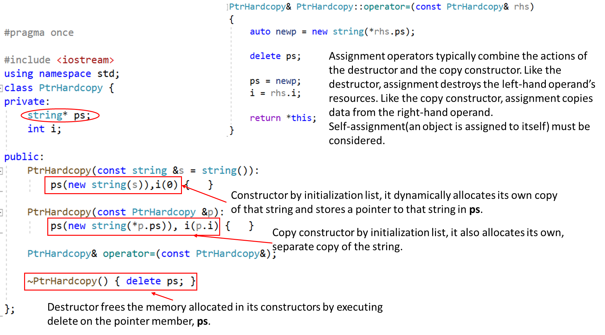
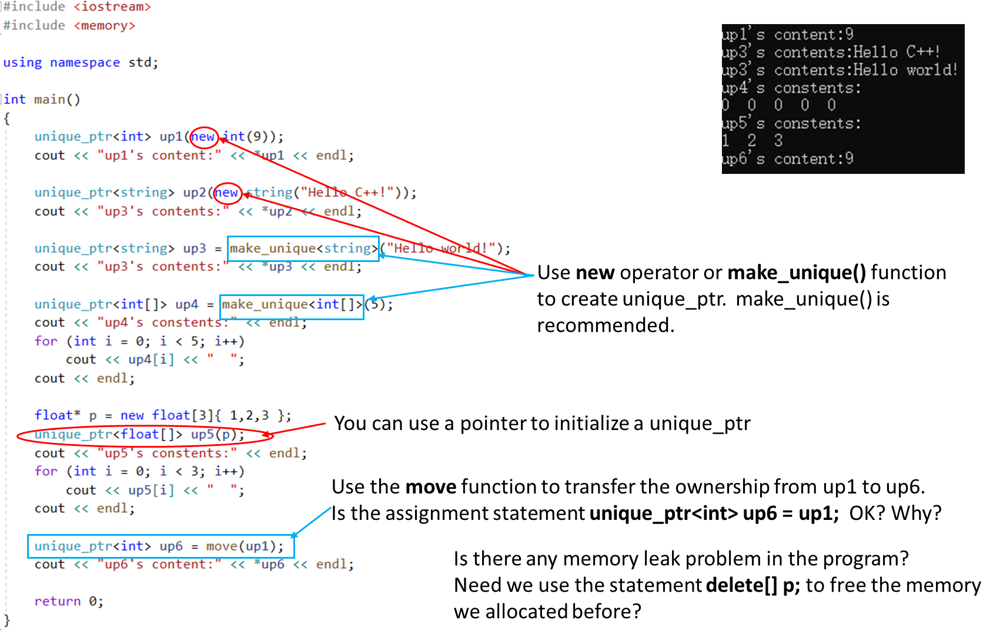
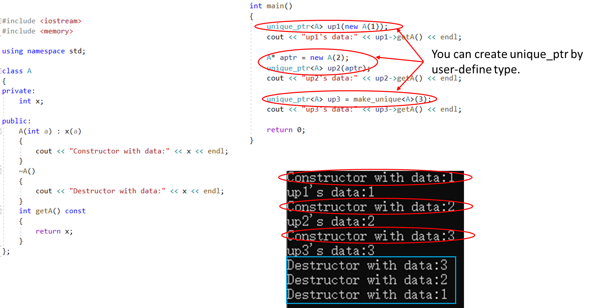
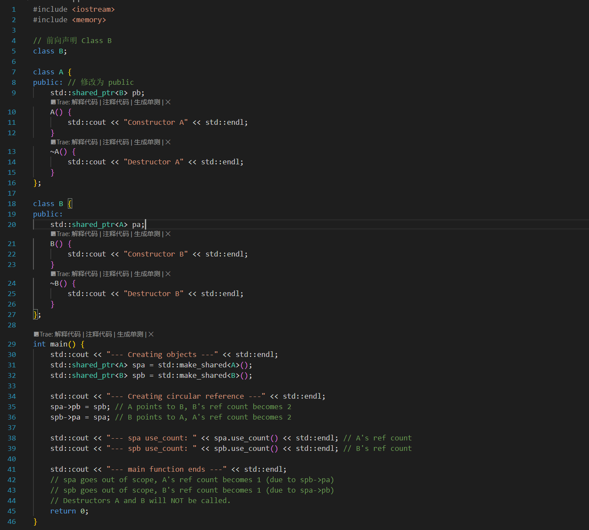
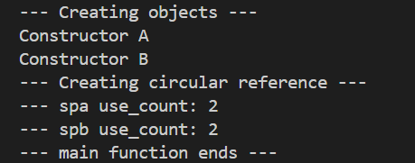
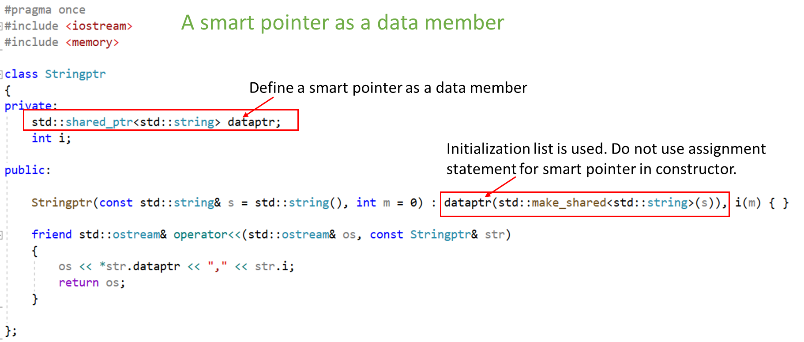
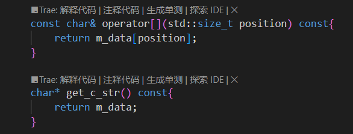
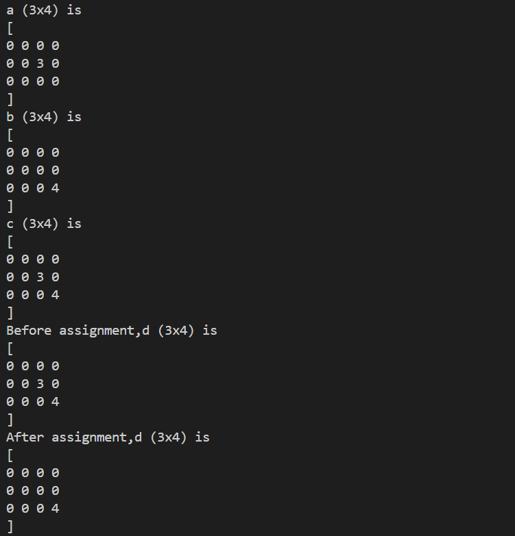

> [!TIP]
>
> Welcome to my CS205 lecture notes! Because the lecture is not in English, I will try my best to translate it.
>
> And at the same time, the `PPT`,`lab-file` also use the English,I will write **the English notes but not all.**

>[!NOTE]
>
>If you have a passion to konw more about the course, you can click the link below to learn more about the course.
>Read the repo.
>
>::github{repo="MongxinChan/CPP"}

> [!IMPORTANT]
>
> 由于本文篇幅过长，个人会添加适当的中文注解在里面。

## Topic Overview

- **Dynamic Memory in Classes**:
    - The "Big Four": Constructor, Destructor, Copy Constructor, Assignment Operator.
    - Deep Copy vs. Shallow Copy (with reference counting).
- **Smart Pointers (`<memory>` header)**:
    - `std::unique_ptr`: Exclusive ownership, `std::make_unique`.
    - `std::shared_ptr`: Shared ownership, reference counting, `std::make_shared`.
    - Using smart pointers as data members.
- **Operator Overloading: The Subscript Operator `[]`**.
- **Copy Constructor Invocation Scenarios**.
- **Exercises**.

## Foreword

Welcome to the Lab 11 study notes! This lab focuses on the critical aspects of managing dynamic memory within C++ classes. We will explore the essential roles of constructors, destructors, copy constructors, and assignment operators when dealing with dynamically allocated resources. 

A significant part of this lab is dedicated to understanding and utilizing C++ smart pointers (`std::unique_ptr` and `std::shared_ptr`) as a safer and more modern approach to memory management, contrasting them with raw pointer management techniques like deep and shallow copies. We'll also touch upon overloading the subscript operator.

#  Dynamic Memory Management in Classes

When a class manages a resource that is acquired dynamically (e.g., memory allocated with `new`), it's crucial to handle its lifecycle correctly to prevent issues like memory leaks or dangling pointers. This typically involves paying special attention to four key member functions.

## 1.1 The "Big Four" (or "Big Three/Five")

For classes managing dynamic resources, the following member functions are particularly important:

1. **Constructor**:

    - Responsible for acquiring resources. If allocating dynamic memory, it uses `new` or `new[]`.
    - Initializes the object's state, including pointers to dynamic resources.

2. **Destructor**:

    - Responsible for releasing acquired resources. If memory was allocated with `new`, it uses `delete`; if with `new[]`, it uses `delete[]`.
    - This is crucial to prevent memory leaks when an object goes out of scope or is explicitly deleted.

3. **Copy Constructor**:

    - Defines how an object is created as a copy of another object of the same class.
    - If the class manages dynamic memory, the default (compiler-generated) copy constructor performs a shallow copy (member-wise copy), which means both the original and the copy will point to the *same* dynamically allocated memory. This can lead to double deletion or corruption when one object is destroyed.
    - A custom copy constructor is often needed to perform a **deep copy**: allocate new memory for the copy and then copy the content from the original object's resource.

4. **Copy Assignment Operator (`operator=`)**:

    - Defines how an existing object is assigned the value of another object of the same class.
    - Similar to the copy constructor, the default assignment operator performs a shallow copy.
    - A custom assignment operator is needed for deep copying. It must also handle:
        - **Self-assignment**: Check if the source and destination objects are the same (`if (this == &rhs) return *this;`).
        - **Resource deallocation**: Release any resources currently held by the left-hand side object before acquiring new ones.

    *(Note: With C++11 and later, move constructor and move assignment operator often complete the "Rule of Five" for classes managing resources, offering more efficient transfers of ownership.)*

## 1.2 Deep Copy vs. Shallow Copy

- **Shallow Copy (Soft Copy)**:

    - Copies the values of the pointer members, not the data they point to.
    - Both original and copy point to the same memory block.
    - **Problem**: If one object's destructor frees the memory, the other object's pointer becomes dangling. Modifying the data through one object affects the other.
    - The default copy constructor and assignment operator perform shallow copies.

- **Deep Copy (Hard Copy)**:

    - Allocates new memory for the copy and then copies the actual data from the original object's resource to the new memory block.
    - Original and copy have independent resources.
    - Requires custom implementation of the copy constructor and copy assignment operator.

    **Example: Deep Copy Implementation**

    ```cpp
    class PtrHardcopy {
    private:
        std::string* ps;
        int i;
    public:
        PtrHardcopy(const std::string& s = std::string()) : ps(new std::string(s)), i(0) {}
        // Copy constructor (deep copy)
        PtrHardcopy(const PtrHardcopy& p) : ps(new std::string(*p.ps)), i(p.i) {}
        // Assignment operator (deep copy)
        PtrHardcopy& operator=(const PtrHardcopy& rhs) {
            if (this == &rhs) return *this; // Handle self-assignment
            delete ps;                      // Free old resource
            ps = new std::string(*rhs.ps);  // Allocate new and copy
            i = rhs.i;
            return *this;
        }
        ~PtrHardcopy() { delete ps; }
    };
    
    ```

    

- **Shallow Copy with Reference Counting**:

    - An alternative to deep copy for sharing data is to use shallow copy combined with reference counting.
    - Multiple objects can share the same data block. A counter tracks how many objects are using the data.
    - The data is deallocated only when the last object using it is destroyed.
    - This is the principle behind `std::shared_ptr`.

    **Example: Shallow Copy with Reference Counting**

    ```cpp
    class PtrSoftcopy {
    private:
        std::string* ps;
        int i;
        std::size_t* num; // Reference counter
    public:
        PtrSoftcopy(const std::string& s = std::string()) :
            ps(new std::string(s)), i(0), num(new std::size_t(1)) {}
    
        PtrSoftcopy(const PtrSoftcopy& p) :
            ps(p.ps), i(p.i), num(p.num) { ++*num; } // Copy pointers, increment count
    
        PtrSoftcopy& operator=(const PtrSoftcopy& rhs) {
            if (this == &rhs) return *this;
            if (--*num == 0) { // Decrement current object's ref count
                delete ps;
                delete num;
            }
            ps = rhs.ps;        // Copy data from rhs
            i = rhs.i;
            num = rhs.num;
            ++*num;             // Increment rhs's ref count
            return *this;
        }
    
        ~PtrSoftcopy() {
            if (--*num == 0) { // If last user, clean up
                delete ps;
                delete num;
            }
        }
    };
    
    ```

    

#  Smart Pointers (`<memory>` header)

**C++11** introduced smart pointers to help manage dynamic memory more safely and easily, automating resource deallocation and preventing common errors like memory leaks and dangling pointers. They follow the RAII (Resource Acquisition Is Initialization) principle.

## 2.1 `std::unique_ptr`

- Represents **exclusive ownership** of a dynamically allocated object.

- When the `unique_ptr` goes out of scope or is destroyed, the object it points to is automatically deleted.

- Cannot be copied (copy constructor and copy assignment are deleted) to enforce exclusive ownership.

- Can be **moved** using `std::move()`, transferring ownership from one `unique_ptr` to another.

- Typically created using `std::make_unique<T>(args...)` (C++14 and later, preferred) or `std::unique_ptr<T>(new T(args...))`.

- Supports a custom deleter.

- Has a specialization for arrays: `std::unique_ptr<T[]>`, which calls `delete[]`.

    **Example:**

    ```cpp
    #include <memory> // Required for smart pointers
    #include <string>
    #include <iostream>
    
    // unique_ptr with a single object
    std::unique_ptr<int> up1(new int(9));
    // std::cout << "up1's content: " << *up1 << std::endl;
    
    // Using make_unique (preferred)
    std::unique_ptr<std::string> up3 = std::make_unique<std::string>("Hello world!");
    // std::cout << "up3's contents: " << *up3 << std::endl;
    
    // unique_ptr for an array
    std::unique_ptr<int[]> up4 = std::make_unique<int[]>(5); // Array of 5 ints
    // for (int i = 0; i < 5; ++i) up4[i] = i * 10;
    
    // Transferring ownership
    std::unique_ptr<int> up6 = std::move(up1);
    // std::cout << "up6's content: " << *up6 << std::endl;
    // std::cout << "up1 is now " << (up1 ? "not null" : "null") << std::endl; // up1 is now null
    
    ```

    
    
    
    
    **Question from slides**: Is `unique_ptr<int> up6 = up1;` OK? Why?
    **Answer**: No, it's not OK. `std::unique_ptr` **<u>cannot</u>** be copied because it **<u>represents exclusive ownership</u>**. This line would cause a **<u>compilation error</u>**. <u>**Ownership must be transferred using `std::move(up1)`.**</u>

## 2.2 `std::shared_ptr`

- Represents **shared ownership** of a dynamically allocated object.

- Multiple `shared_ptr` instances can point to the same object.

- Maintains an internal **reference count** that tracks how many `shared_ptr`s are pointing to the object.

- The object is automatically deleted when the last `shared_ptr` owning it is destroyed or reset.

- Can be copied, and doing so increments the reference count.

- Typically created using `std::make_shared<T>(args...)` (preferred, more efficient as it allocates memory for the object and the control block in one go) or `std::shared_ptr<T>(new T(args...))`.

- The reference count can be queried using the `use_count()` member function.

    **Example:**

    ```cpp
    #include <iostream>
    #include <memory>
    
    class B;
    
    class A {
    public:
        std::shared_ptr<B> pb;
        A() {
            std::cout << "Constructor A" << std::endl;
        }
        ~A() {
            std::cout << "Destructor A" << std::endl;
        }
    };
    
    class B {
    public:
        std::shared_ptr<A> pa;
        B() {
            std::cout << "Constructor B" << std::endl;
        }
        ~B() {
            std::cout << "Destructor B" << std::endl;
        }
    };
    
    int main() {
        std::cout << "--- Creating objects ---" << std::endl;
        std::shared_ptr<A> spa = std::make_shared<A>();
        std::shared_ptr<B> spb = std::make_shared<B>();
    
        std::cout << "--- Creating circular reference ---" << std::endl;
        spa->pb = spb; // A points to B, B's ref count becomes 2
        spb->pa = spa; // B points to A, A's ref count becomes 2
    
        std::cout << "--- spa use_count: " << spa.use_count() << std::endl; // A's ref count
        std::cout << "--- spb use_count: " << spb.use_count() << std::endl; // B's ref count
    
        std::cout << "--- main function ends ---" << std::endl;
        // spa goes out of scope, A's ref count becomes 1 (due to spb->pa)
        // spb goes out of scope, B's ref count becomes 1 (due to spa->pb)
        // Destructors A and B will NOT be called.
        return 0;
    }
    ```

    

- Potential Issue: Circular References

    If two objects hold shared_ptrs to each other, they can create a circular reference. In this case, their reference counts will never drop to zero even if no external shared_ptrs point to them, leading to a memory leak. std::weak_ptr can be used to break such cycles.

    

## 2.3 Using Smart Pointers as Data Members

It's common and often recommended to use smart pointers as data members in classes that need to manage the lifetime of other dynamically allocated objects.

```cpp
#include <memory>
#include <string>
#include <iostream>

class StringPtr {
private:
    std::shared_ptr<std::string> dataptr; // Smart pointer as a data member
    int i;
public:
    StringPtr(const std::string& s = std::string(), int m = 0) :
        dataptr(std::make_shared<std::string>(s)), i(m) {}

    friend std::ostream& operator<<(std::ostream& os, const StringPtr& str) {
        os << *str.dataptr << ", " << str.i;
        return os;
    }
};
```



Using smart pointers as members simplifies resource management as the smart pointer's destructor will automatically handle the deallocation of the pointed-to resource.

#  Operator Overloading: The Subscript Operator `[]`

The subscript operator `[]` is commonly overloaded for classes that represent array-like structures or containers, allowing access to elements using array notation.

- It's typically overloaded in two versions:

    1. Non-const version: Returns a reference to an element, allowing modification.

        `T& operator[](std::size_t index);`

    2. const version: Returns a const reference or a value (if copying is cheap and modification is not allowed), used with const objects.

        `const T& operator[](std::size_t index) const; `or` T operator[](std::size_t index) const;`

    **Example: A simple String class**

    ```cpp
    // Simplified String class
    class String {
    private:
        char* m_data;
        // ... other members like size, capacity ...
    public:
        // ... constructors, destructor, etc. ...
    
        char& operator[](std::size_t position) {
            // Add bounds checking if necessary
            return m_data[position];
        }
    
        const char& operator[](std::size_t position) const {
            // Add bounds checking if necessary
            return m_data[position];
        }
        // ...
    };
    
    ```

    > [!NOTE]
    >
    > 如果你有兴趣可以点击如下链接进行访问String.h和String.cpp
    
    
    
    

#  When is a Copy Constructor Called?

A copy constructor is typically invoked in the following situations:

1. **When an object is initialized with another object of the same class**:

    - `MyClass obj2 = obj1;`
    - `MyClass obj3(obj1);`

2. **When an object is passed to a function by value**: A copy of the argument is made.

3. **When an object is returned from a function by value**: A copy of the local object is made to be returned (though often elided by RVO/NRVO).

4. **When a temporary object is generated by the compiler** (e.g., during certain type conversions or expression evaluations, though less common with modern C++ optimizations).

    **Example:

    - `Complex c1(c2);`
    - `Complex c3 = c1;`
    - `Complex c4 = Complex(c1);` (Explicit call to constructor, then copy/move)
    - `Complex *pc = new Complex(c1);` (A `Complex` object is copy-constructed, and `pc` points to it)

> [!NOTE]
>
> 也就是说
>
> - 当一个对象使用同一个类的另一个对象初始化
> - 当一个对象按值传递给函数时
> - 当一个对象从函数按值返回时
> - 当编译器生成临时对象时
>
> 都可以将拷贝构造函数给另一对象使用。

#  Exercises

## Exercise 1

Could the program below be compiled successfully? Why? Modify the program until it passes compilation. Then run the program. What will happen? Explain the result to the TA.

```cpp
#include <iostream>
#include <memory>
using namespace std;
int main()
{
    double *p_reg = new double(5);
    shared_ptr<double> pd;
    pd = p_reg;         
    pd = shared_ptr<double>(p_reg); 
    cout << "*pd = " << *pd << endl;


    shared_ptr<double> pshared = p_reg; 
    shared_ptr<double> pshared(p_reg); 
    cout << "*pshred = " << *pshared << endl;

    
    string str("Hello World!");
    shared_ptr<string> pstr(&str); 
    cout << "*pstr = " << *pstr << endl;

    return 0;
}
```


**Hints for Solution**:

- **Problem 1 & 2 (`pd = p_reg;` and `pshared = p_reg;`)**: You cannot directly assign a raw pointer to a `std::shared_ptr` using the assignment operator. `std::shared_ptr` needs to be constructed with the raw pointer, or `reset()` must be called. More importantly, if `pd` is already managing `p_reg`, creating `pshared` independently from `p_reg` again (`std::shared_ptr<double> pshared(p_reg);`) will result in two separate `shared_ptr`s (each with its own control block/reference count) managing the *same* raw pointer. This will lead to a double deletion when both `shared_ptr`s go out of scope. The correct way to share ownership is to copy an existing `shared_ptr`: `std::shared_ptr<double> pshared = pd;`.
- **Problem 3 (`std::shared_ptr<string> pstr(&str);`)**: `std::shared_ptr` (by default) assumes it owns dynamically allocated memory (from `new`) and will call `delete` on it when the reference count drops to zero. `str` is a local (stack-allocated) object. Attempting to `delete` stack memory leads to undefined behavior (typically a crash). `shared_ptr` should manage heap objects. If you need a `shared_ptr` to a stack object (rarely advisable), you'd need a custom deleter that does nothing.
- **Compilation**: The direct assignments `pd = p_reg;` and `pshared = p_reg;` will cause compilation errors. The construction `std::shared_ptr<string> pstr(&str);` will compile but will lead to runtime errors.
- **Runtime**: If "fixed" to compile by constructing `shared_ptr`s from `p_reg` independently (e.g., `pd.reset(p_reg); std::shared_ptr<double> pshared(p_reg);`), the program will likely crash due to double free. The `pstr(&str)` issue will also cause a crash.

## Exercise 2

Create a class Matrix to describe a matrix. The element type is float. One member of the class is a pointer (or a smart pointer) that points to the matrix data.

The two matrices can share the same data through a copy constructor or a copy assignment.

The following code should run smoothly without memory problems.

The output sample shows matrices a, b, c (result of a+b), and d (initially copy of a, then assigned b).

```cpp
// Target usage
class Matrix{/* ... */};
    Matrix a(3,4); // Initialize a 3x4 matrix
    Matrix b(3,4); // Initialize another 3x4 matrix
    // ... (initialize elements of a and b) ...
    Matrix c = a + b; // Requires operator+
    Matrix d = a;   // Requires copy constructor (for shared data)
    d = b;          // Requires copy assignment operator (for shared data)
    // ... (print matrices) ...

```



**Hints for Solution**:

- **Data Storage**: Use `std::shared_ptr<float[]>` or `std::shared_ptr<std::vector<float>>` to store the matrix data. This will handle shared ownership and automatic deallocation naturally.

- **Dimensions**: Store rows and columns as members.

- **Constructor**: Allocate memory for `rows * cols` floats. Initialize elements (e.g., to zero or from input).

- **Copy Constructor**:

    - `Matrix(const Matrix& other)`: If using `shared_ptr`, simply copy the `shared_ptr`. This achieves data sharing. The reference count will be incremented.

        ```cpp
        // Assuming 'data' is std::shared_ptr<float[]>
        Matrix(const Matrix& other) : rows(other.rows), cols(other.cols), data(other.data) {}
        ```

- **Copy Assignment Operator**:

    - `Matrix& operator=(const Matrix& other)`: Handle self-assignment. If using `shared_ptr`, assign the `shared_ptr`. The old data managed by `this->data` will have its reference count decremented (and deleted if it becomes zero), and `this->data` will then share ownership with `other.data`.

        ```cpp
        Matrix& operator=(const Matrix& other) {
             if (this == &other) return *this;
            rows = other.rows;
            cols = other.cols;
            data = other.data; // shared_ptr assignment handles ref counts
            return *this;
        }
        ```

- **`operator+`**:

    - `Matrix operator+(const Matrix& other) const;`
    - Check if dimensions match for addition. If not, handle error (e.g., throw exception or return an empty/error matrix).
    - Create a new `Matrix` for the result.
    - Perform element-wise addition.
    - Return the result matrix by value.

- **Helper functions**: For setting/getting elements, printing the matrix.

---

*CC BY NC SA (Content adapted from course materials)*
