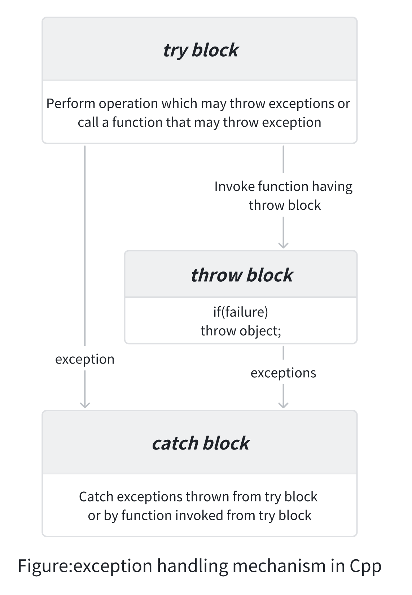
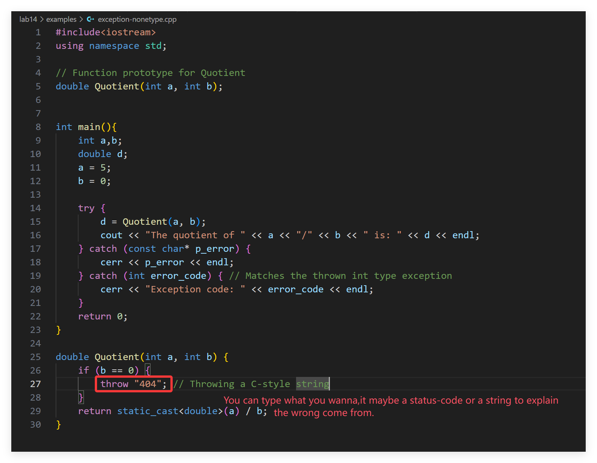
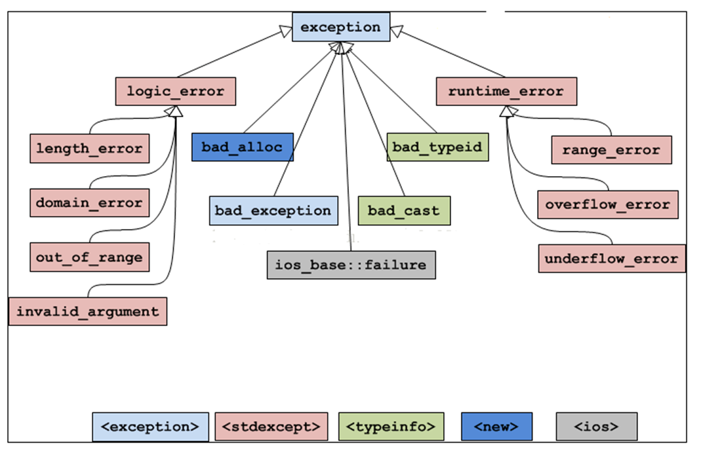

> [!TIP]
>
> Welcome to my CS205 lecture notes! Because the lecture is not in English, I will try my best to translate it.
>
> And at the same time, the `PPT`,`lab-file` also use the English,I will write **the English notes but not all.**

>[!NOTE]
>
>If you have a passion to konw more about the course, you can click the link below to learn more about the course.
>Read the repo.
>
>::github{repo="MongxinChan/CPP"}

> [!IMPORTANT]
>
> 由于本文篇幅过长，个人会添加适当的中文注解在里面。

## Topic Overview

- **Exceptions and Exception Handling**:
    - What is an exception?
    - C++ exception handling mechanism: `try`, `throw`, `catch`
    - Exception handling and resource management (RAII)
- **Defining and Using Exception Classes**:
    - User-defined exception classes
    - Handling exceptions from an inheritance hierarchy
    - Order of `catch` clauses
- **C++ Standard Exceptions**:
    - Standard exception classes in `<stdexcept>` header
    - The `std::exception` class and its `what()` method
    - The `noexcept` specifier
    - Throw by value, catch by reference
- **Assertions**:
    - `assert` macro usage
    - Purpose and applicable scenarios for assertions
- **Exercises**

## Foreword

Welcome to the Lab 14 study notes! This lab will introduce the exception handling mechanism in C++, a powerful way to deal with errors that allows programs to respond to unexpected situations (exceptions) at runtime. We will learn the usage of `try`, `throw`, and `catch` keywords, how to define and use custom exception classes, and how to leverage the exception classes provided by the C++ standard library. Additionally, we will explore assertions (`assert`) as a debugging tool.

# Exceptions and Exception Handling

## 1.1 What is an exception?

An exception is an unexpected or anomalous situation that occurs during program execution, interrupting the normal flow of instructions. For example, division by zero, memory allocation failure, or a file not being found can all raise exceptions. If not handled, an exception typically leads to program termination.

Exception handling provides a structured way to detect and respond to these error conditions, enabling programs to run more robustly or at least fail in a controlled manner (e.g., by saving data before exiting).

## 1.2 C++ Exception Handling Mechanism: `try`, `throw`, `catch`



C++ provides the following three keywords to support exception handling:

- **`try`**: A `try` block encloses code that might throw an exception. If code within a `try` block throws an exception, control is immediately transferred to an appropriate `catch` block.
- **`throw`**: When an error condition is detected, a `throw` expression can be used to "throw" an exception. What is thrown can be a value (like an integer or a string literal) or an object (typically an object of an exception class).
- **`catch`**: A `catch` block immediately follows a `try` block and is used to catch and handle a specific type of exception. There can be multiple `catch` blocks to handle different types of exceptions. `catch(...)` can catch any type of exception.

**Basic Flow**:

1. Program execution enters a `try` block.
2. If a `throw` statement is executed within the `try` block (or in a function called from the `try` block), an exception is thrown.
3. The program immediately exits the current execution path and starts looking for a `catch` block that matches the type of the thrown exception.
4. `catch` blocks are examined in the order they appear. The first `catch` block whose parameter type matches the thrown exception (or can be converted from the thrown exception type) is executed.
5. If a matching `catch` block is found, the code within that block is executed. After execution, the program typically continues with the code following the last `catch` block (unless the `catch` block itself re-throws an exception or terminates the program).
6. If no matching `catch` block is found, the exception propagates up the call stack until it is caught somewhere, or if it reaches the `main` function and is still unhandled, the program usually calls `std::terminate()` to halt.

**Example 1: Throwing an exception in `main`'s `try` block**

```cpp
#include <iostream>

int main() {
    int a = 5, b = 0;
    double d;
    try {
        if (b == 0) {
            throw "The divisor can not be zero!"; // Throwing a C-style string
        }
        d = static_cast<double>(a) / b;
        std::cout << "The quotient of " << a << "/" << b << " is: " << d << std::endl;
    } catch (const char* p_error) { // Catches const char* type exceptions
        std::cerr << p_error << std::endl;
    } catch (int error_code) { // Catches int type exceptions (won't match here)
        std::cerr << "Exception code: " << error_code << std::endl;
    }
    return 0;
}
```


**Example 2: Throwing an exception in another function, handled by `catch` in `main`**

```cpp
#include <iostream>

double Quotient(int a, int b) {
    if (b == 0) {
        throw 404; // Throwing an int type exception
    }
    return static_cast<double>(a) / b;
}

int main() {
    int a = 5, b = 0;
    double d;
    try {
        d = Quotient(a, b);
        std::cout << "The quotient of " << a << "/" << b << " is: " << d << std::endl;
    } catch (const char* p_error) {
        std::cerr << p_error << std::endl;
    } catch (int error_code) { // Matches the thrown int type exception
        std::cerr << "Exception code: " << error_code << std::endl;
    }
    return 0;
}
```


> [!NOTE]
>
>  In general, no implicit type conversions are applied when matching exceptions to `catch` clauses (though inheritance-based conversions are an exception, discussed later). If the thrown exception type **DOSE NOT match** any `catch` clause's parameter type, the program will terminate.
>
> 
>
> 

## 1.3 Exception Handling and Resource Management (RAII)

When an exception occurs, the code between the exception point in the `try` block and the beginning of the `catch` block (including destructors of objects in the current scope) is executed. This process is called **stack unwinding**. This is very important for automatic resource management.

**RAII (Resource Acquisition Is Initialization)** is a common C++ programming paradigm that binds the lifecycle of a resource to the lifecycle of an object. Resources are acquired during object construction and released during object destruction.

* If RAII is not used (e.g., manual `new` followed by `delete` at the end of a `try` block), an exception can prevent the `delete` from being executed, leading to a resource leak.
    ```cpp
    Polygon *p = new Rectangle(4,5);
    p->printarea(); // If an exception is thrown here
    delete p;       // This line might not be executed
    ```
* **Solution 1: Clean up in `catch` block and re-throw**
    ```cpp
    Polygon *p = new Rectangle(4,5);
    try {
        p->printarea();
    } catch (...) {
        delete p; // Clean up resource
        throw;    // Re-throw the exception for higher-level handling
    }
    delete p; // Clean up if no exception occurred
    ```
* **Solution 2: Use Smart Pointers (Embodiment of RAII)**
    Smart pointers (like `std::unique_ptr` or `std::shared_ptr`) automatically release the managed resource in their destructors. Even if an exception causes stack unwinding, the smart pointer's destructor will be called, ensuring the resource is freed.
    ```cpp
    std::shared_ptr<Polygon> sp(new Rectangle(10, 20));
    sp->printarea(); // If an exception is thrown here, sp's destructor will still be called,
                     // thereby deleting the Polygon object.
    ```

---

#  Defining and Using Exception Classes

While any type of value can be thrown, it is generally recommended to throw objects of class types, especially classes derived from `std::exception` or its descendants. Doing so allows carrying more information about the error.

## 2.1 User-Defined Exception Classes

We can define our own exception classes to represent specific error conditions.
````cpp
#include <iostream>
#include <limits>
using namespace std;

class RangeError {
private:
    int val;
public:
    RangeError(int v) : val(v) {}
    int getValue() const { return val; }
};

char to_char(int n){
    if(n < numeric_limits<char>::min() || n > numeric_limits<char>::max()) {
        throw RangeError(n);
    }
    return (char)n;
}

void gain(int n){
    try{
        char c = to_char(n);
        cout << "The character representation of " << n << " is: " << c << endl;
    } catch (const RangeError& e) {
        cerr << "RangeError: Value " << e.getValue() << " is out of range for char type." << endl;
        cerr << "Range is" << (int) numeric_limits<char>::min() << " to " 
             << (int) numeric_limits<char>::max() << endl;
    } catch (...) {
        cerr << "An unexpected error occurred." << endl;
    }
}

int main(){
    gain(-130);

    return 0;
}
````

Compilers may issue warnings for such ordering.


#  C++ Standard Exceptions

The C++ standard library defines a hierarchy of standard exception classes in `<stdexcept>` and other headers. They all (directly or indirectly) derive from `std::exception`.

## 3.1 The `std::exception` Class and its `what()` Method

`std::exception` is the base class for all standard C++ exceptions. It is defined in the `<exception>` header.

- It has an important virtual member function: `virtual const char* what() const noexcept;` (or `throw()` in older standards).
- The `what()` method returns a C-style string describing the exception. Derived classes typically override this method to provide more specific error information.

**Example Standard Exception Class Hierarchy (Partial)**:

| Exception               | Description                                                  |
| ----------------------- | ------------------------------------------------------------ |
| `std::exception`        | An exception and parent class of all the standard C++ exceptions. |
| `std::bad_alloc`        | This can be thrown by `new`.                                 |
| `std::bad_cast`         | This can be thrown by `dynamic_cast`.                        |
| `std::bad_exception`    | Useful to handle unexpected exceptions in a C++ program.     |
| `std::bad_typeid`       | This can be thrown by `typeid`.                              |
| `std::logic_error`      | An exception that theoretically can be detected by reading the code. |
| `std::domain_error`     | Thrown when a mathematically invalid domain is used.         |
| `std::invalid_argument` | Thrown due to invalid arguments.                             |
| `std::length_error`     | Thrown when a too big `std::string` is created.              |
| `std::out_of_range`     | Can be thrown by the `at` method of `std::vector` and `std::bitset`. |
| `std::runtime_error`    | An exception that theoretically cannot be detected by reading the code. |
| `std::overflow_error`   | Thrown if a mathematical overflow occurs.                    |
| `std::range_error`      | Occurs when you try to store a value which is out of range.  |
| `std::underflow_error`  | Thrown if a mathematical underflow occurs.                   |



**Custom Exception Class Inheriting from `std::exception`**:

```cpp
#include <iostream>
#include <exception> // For std::exception
#include <string>    // For std::string

class MyException : public std::exception {
private:
    std::string m_msg;
public:
    MyException(const std::string& msg) : m_msg(msg) {}

    // Override the what() method
    // C++11 and later recommend using noexcept
    const char* what() const noexcept override {
        return m_msg.c_str();
    }
};

int main() {
    try {
        throw MyException("Custom C++ Exception.");
    } catch (const MyException& me) { Catch derived class first
        std::cout << "MyException is caught." << std::endl;
        std::cout << me.what() << std::endl;
    } catch (const std::exception& e) { // Then catch base class
        std::cout << "Base class exception is caught." << std::endl;
        std::cout << e.what() << std::endl;
    }
    return 0;
}

```


## 3.2 The `noexcept` Specifier (C++11)

`noexcept` is a function specifier that indicates that the function guarantees not to throw any exceptions.
* `void func() noexcept;` // func will not throw exceptions
* `void func() noexcept(expression);` // If expression is true, func will not throw exceptions
* `noexcept` (equivalent to `noexcept(true)`) and `throw()` (deprecated in C++17, removed in C++20) are equivalent.
* If a function declared `noexcept` actually throws an exception, the program calls `std::terminate()`.
* Destructors, `delete` operators, and move operations (move constructors, move assignment operators) are implicitly `noexcept` unless explicitly specified otherwise or if functions they call might throw.

## 3.3 Throw by Value, Catch by Reference

This is the recommended practice for handling exceptions:
* **Throw by Value**: `throw MyException("Error");`
    * This creates a copy (or move, if applicable) of the exception object to be passed to the `catch` block.
* **Catch by Reference**: `catch (const MyException& e)`
    * **Avoids Object Slicing**: If a base class exception is caught by value (`catch (std::exception e)`), and a derived class object was actually thrown, the derived-specific part of the object will be "sliced off." `e` will only contain the base class part. Calling virtual functions (like `e.what()`) will call the base class version.
    * **Avoids Unnecessary Copying**: Catching by reference avoids another copy of the exception object.
    * Usually, catch a `const` reference, as the `catch` block should not modify the exception object.


---

#  Assertions

Assertions (`assert`) are a debugging aid used to check conditions in code that the programmer believes should always be true.

## 4.1 `assert` Macro Usage

`assert` is a macro defined in `<cassert>` (C++) or `<assert.h>` (C).
* **Syntax**: `assert(expression);`
* **Behavior**:
    * If `expression` evaluates to false (0), `assert` outputs a message to the standard error stream (stderr) indicating the failed expression, source filename, and line number, and then calls `std::abort()` to terminate the program.
    * If `expression` is true (non-zero), `assert` does nothing.

    ```cpp
    #include <cassert> // Or #include <assert.h>
    #include <iostream>
    ```
    

## 4.2 Purpose and Applicable Scenarios for Assertions

* **Purpose**: Primarily used during development and debugging to catch logical errors or situations that should never occur. They validate the internal state of the program and the programmer's assumptions.
* **Applicable Scenarios**:
    * Checking the validity of function arguments (preconditions).
    * Checking the validity of function return values (postconditions).
    * Checking loop invariants.
    * Verifying logically impossible situations in code.
* **Considerations**:
    * Each `assert` should ideally test only one condition, so it's clear which condition failed if the assertion triggers.
        ```cpp
        // Not recommended
         assert(nOffset >= 0 && nOffset + nSize <= m_nInformationSize);
        // Recommended
         assert(nOffset >= 0);
         assert(nOffset + nSize <= m_nInformationSize);
        ```
        
        * All `assert` calls can be removed at compile time by defining the macro `NDEBUG` (No Debug) before including `<cassert>`. This is typically done for release builds to avoid performance overhead and program termination due to assertions.
            ```cpp
             #define NDEBUG // Place before #include <cassert>
             #include <cassert>
            ```
        * Assertions should not be used to handle expected runtime errors (like user input errors, file not found, etc.), which should be handled by exception handling or other error-handling mechanisms. Assertions are for programmer errors.

---

#  Exercises

## Exercise 1
Are there any warnings in the program below when it is compiled? What do the warnings mean? Run the program regardless of warnings and explain the result to the TA. Fix the warnings and run the program again.

```cpp
#include <iostream>
#include <string>
#include <exception> // For std::exception

// using namespace std; // Avoid in global scope

class MyException : public std::exception {
public:
    MyException(const std::string& msg) : m_msg(msg) {
        std::cout << "MyException::MyException - set m_msg to:" << m_msg << std::endl;
    }
    ~MyException() noexcept { // Destructors should generally be noexcept
        std::cout << "MyException::~MyException" << std::endl;
    }
    // what() should also be noexcept and marked override
    virtual const char* what() const noexcept override {
        std::cout << "MyException::what" << std::endl;
        return m_msg.c_str();
    }
    const std::string m_msg; // Better to make private and access via getter
};

void throwDerivedException() {
    std::cout << "throwDerivedException - thrown a derived exception" << std::endl;
    std::string exceptionMessage("MyException thrown");
    throw MyException(exceptionMessage); // Throw by value
}

void illustrateDerivedExceptionCatch() {
    std::cout << "illustrateDerivedExceptionsCatch - start" << std::endl;
    try {
        throwDerivedException();
    }
    // Warning: Base class catch block before derived class makes derived catch unreachable
    catch (const std::exception& e) { // Base class catch block
        std::cout << "illustrateDerivedExceptionsCatch - caught an std::exception, e.what:" << e.what() << std::endl;
    }
    // This catch block will never be executed because MyException will be caught by std::exception above
    catch (const MyException& e) { // Derived class catch block
        std::cout << "illustrateDerivedExceptionsCatch - caught a MyException, e.what::" << e.what() << std::endl;
    }
    std::cout << "illustrateDerivedExceptionsCatch - end" << std::endl;
}

int main(int argc, char** argv) {
    std::cout << "main - start" << std::endl;
    illustrateDerivedExceptionCatch();
    std::cout << "main - end" << std::endl;
    return 0;
}
```

**Hints for Solution**:

- **Warning**: The compiler will warn that the `catch` block for the derived class `MyException` is unreachable because it appears after the `catch` block for its base class `std::exception`.
- **Runtime Result (with warning)**: `MyException` will be caught by `catch (const std::exception& e)` because `MyException` is a derived class of `std::exception`. `e.what()` will correctly call `MyException::what()` due to virtual function dispatch.
- **Fix**: Move the `catch` block for `MyException` before the `catch` block for `std::exception`.

## Exercise 2

Define a generic class “GoldenRectangle” for a golden rectangle in the “golden_rectangle. h” , When testing based on the following main methods, the test results are shown in the bottom figure.

Except:


---

*CC BY NC SA (Content adapted from course materials)*