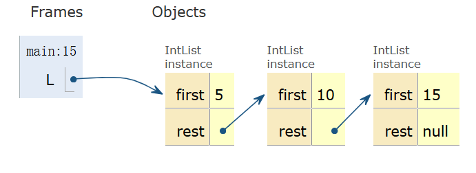
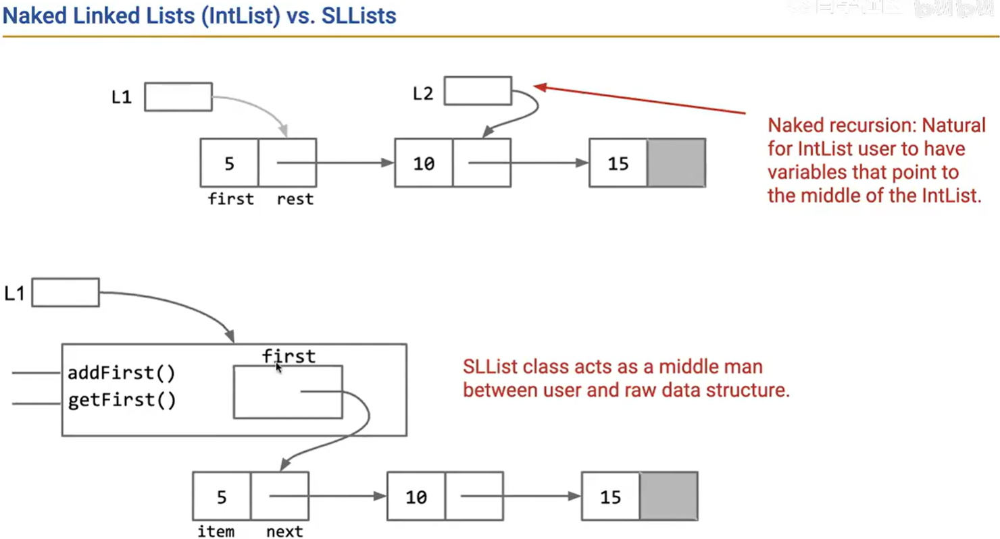
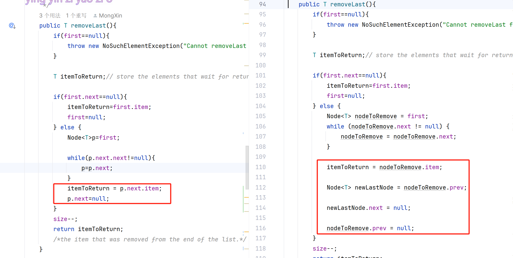
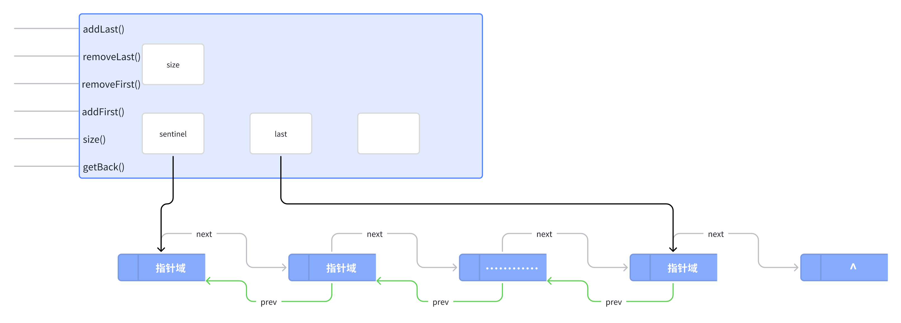
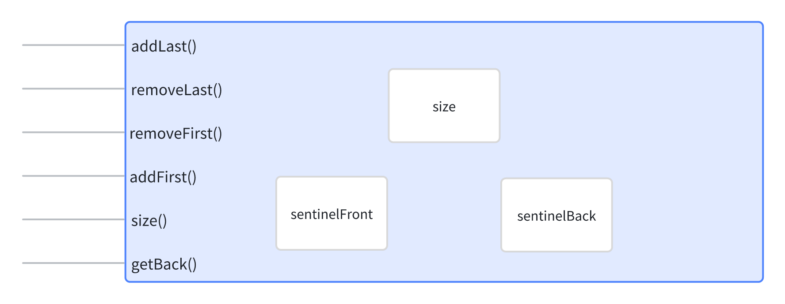
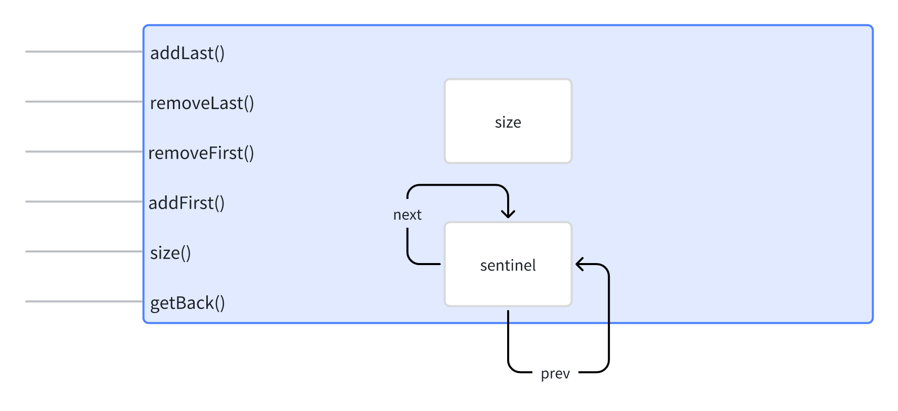
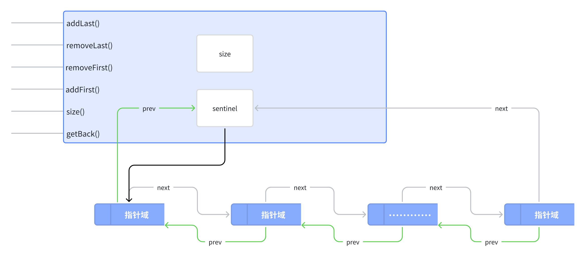

数据结构是计算机存储、组织数据的方式。选择合适的数据结构对于设计高效的算法和程序至关重要。

## 前言

列表（List）是一个抽象的数据结构概念，它表示元素的有序集合，支持元素访问、修改、添加、删除和遍历等操作。使用者通常无须考虑其具体的容量限制问题，因为列表的实现会处理动态扩容。常见的列表实现方式有基于动态数组和基于链表两种。

链表（Linked List）天然可以看作一种列表实现。它通过节点间的指针相连，支持元素的增删查改操作，并且可以灵活动态扩容。

传统的数组也支持元素的增删查改，但由于其长度不可变，因此只能看作一个具有固定容量限制的列表。为了克服这个限制，我们可以使用 **动态数组（Dynamic Array）**来实现列表。

我们将列表的具体实现进一步区分为：

1. **基于动态数组的列表**：例如 Java 中的 `ArrayList`、C++ 中的 `vector` 和 C# 中的 `List`。这类列表通过动态调节内部数组的大小来实现动态扩容，具有强大的容量适应性。**在接下来的讨论中，当我们提及此类实现时，有时会将“列表”和“动态数组”视为近似或等同的概念，特指这种实现方式。**
2. **基于链表的列表**：例如 Java 中的 `LinkedList`。这类列表则通过节点链接的方式组织数据，**富有高效插入和删除操作的灵活性（尤其是在列表中间）。**

链表（Linked Lists）是一种线性数据结构，它不像数组那样在内存中连续存储元素。相反，链表中的每个元素（称为节点 Node）包含数据以及一个或多个指向其他节点的引用（指针）。


常见的链表类型包括三种。

- **单向链表**：即前面介绍的普通链表。单向链表的节点包含值和指向下一节点的引用两项数据。我们将首个节点称为头节点，将最后一个节点称为尾节点，尾节点指向空 `None` 。
- **环形链表**：如果我们令单向链表的尾节点指向头节点（首尾相接），则得到一个环形链表。在环形链表中，任意节点都可以视作头节点。
- **双向链表**：与单向链表相比，双向链表记录了两个方向的引用。双向链表的节点定义同时包含指向后继节点（下一个节点）和前驱节点（上一个节点）的引用（指针）。相较于单向链表，双向链表更具灵活性，可以朝两个方向遍历链表，但相应地也需要占用更多的内存空间。


在本数据结构章节中，我们将尽可能地从其性质、其实现进行讲述，这意味着通篇的代码量会比较多。为了不显得单调，我也会适当补充图片来加以说明，让每个阅读的人都可以清晰地理解这一步操作中到底发生了什么事情。

# 单链表（Singly Linked List）

在单链表中，每个节点包含两部分：

1. **数据 (Data/Item):** 存储元素的值。
2. **下一个节点的引用 (Next):** 指向链表中的下一个节点。最后一个节点的“下一个”引用通常为 `null`。

我们常用java的包引入:

```java
import java.util.List;
import java.util.LinkedList;

//某段函数体内
{
 	List<String> newLists=new LinkedList<>();
    newLists.add("I am fine!");
    newLists.add("You jump I jump");
}
```

> [!TIP]
>
> 为什么要使用`java.util.List`?
>
> 这是要把创建的对象建立在List接口上，试想一下，如果我们想要把这个对象传递给其他函数体，那么此时我们需要进行传参，这时候我们可以直接写入泛泛的API接口，即`public void someFunction(List a){}`，这时候我们并不关心其具体是怎样实现的，我们只知道**借用该接口完成了类的具体操作**，这样给我们的后续开发中带来了许多的成效，比如我们发现在`public void readFunction(ArrayList a){}`中发现，`ArrayList`的读取速度比`LinkedList`快多了，这时候我们把传参的对象类型写作`ArrayList`即可。
>
> 假设说我们一开始定义的是
>
> ```java
> 	LinkedList<String> newLists=new LinkedList<>();
>        newLists.add("I am fine!");
>        newLists.add("You jump I jump");
> ```
>
> 我们在后续的传参过程中需要**一直（constantly）** 去强调其数据类型即`LinkedList`，**换句话说，说这个对象传参被我们写死了**。
>
> 我们引用`java.util.List`这是利于我们的灵活处理数据，而不是泛泛而谈。

### 1.1 InitList

本小节首先讲述如何定义一个简易的链表。理解链表的基本构成，是后续掌握其初始化方法（例如递归实现等技巧）的基础。 

回顾一下定义：链表（Linked List）是一种线性数据结构，它的每一个元素都是一个独立的节点（Node）对象。**这些节点通过“引用”（可以理解为指针）相互连接。“引用”记录了序列中下一个节点的内存地址，从而允许我们从当前节点访问到下一个节点。**


- 具体示例代码

    ```java
    package ListsSinglyLinked;
    
    public class InitList{
        public int first;
        public InitList rest;
    
        public InitList(int f,InitList r){
            first=f;
            rest=r;
        }
        public static void main(String [] args){
            InitList L=new InitList(15,null);
            //System.out.println(L);
    
            L=new InitList(10,L);
            //System.out.println(L);
    
            L=new InitList(5,L);
            //System.out.println(L);
        }
    }
    ```

    我们可以从下面的可视化图片中得知，这里`5`指向`10`，`10`又指向了第一个生成的`15`，并且Frames显示的是`15`，`15` 代表 `main` 函数栈帧中的某个其他变量的值，或者是某个操作的结果。其指向的列表头是`5`




### 1.2 从 `Naked LinkedLists (InitLists)` 到 `SLList`




> [!NOTE]
>
> 这里引入了 SLList (Singly Linked List) 的概念，旨在提供一个**更封装**、**更易用**的链表接口。

在上图，我们发现在`InitNode`中L1，L2分别指向的是存储5，10数值的结构单元，这种将裸露的节点并不方便我们的后续调用，而且时分多余。这时候我们需要借助`SLList`这个**中间人**来解决这个问题，我们可以把SLList当作一个优秀的管理员，他可以帮我们规划好其中的节点如何指向下一个节点，而下一个节点又指向其下一个节点，直到没有指向的下一个数据域，此时记作`null`。

> [!TIP]
>
> 为什么直接用`InitNode`有点**麻烦**？
>
> 如果你有一堆这样零散的“小卡片”（或者说一堆散装的火车车厢），让你自己去手动把它们一个一个串起来，还要时刻记住第一张是哪张，哪张连着哪张……这就有点太折腾人了，很容易出错。程序员们觉得这种“裸露”的、需要自己动手精细操作的节点不太好用。

举个例子，这里以《赛博朋克2077》中的中间人概念来讲解：

每个“任务步骤” (`InitNode`) 本身很简单，只管好自己的信息 (`item`) 和指向下一个步骤的连接 (`next`)，但是不够安全，或者步骤过于繁杂。

而“中间人” (`SLList`) 则运筹帷幄，灵活地组织、调整这些步骤，确保整个“任务”能顺利进行。当**用户**想知道下一步干嘛，或者想在计划里加点料，都得通过这位 `SLList` 中间人，来协调这些“任务”的进行。

> [!IMPORTANT]
>
> 一开始我们可能让大家都能看到中间人的小本上写的第一张是谁，但以后为了更专业、更安全，中间人可能会把这个信息藏起来——也就是设为 `private`，甚至用一些更高级的技巧比如“哨兵节点”来管理。

用户本身作为一个发布任务的**金主**，其可以对该任务的步骤进行删减，这也是其`addFirst()`的作用，我们把这个任务步骤添置到第一步，`getFirst()`获得到第一个步骤的具体信息。

这样做最大的好处是：我们那些“小卡片”(`InitNode`) 就可以设计得非常“傻瓜”或者说“单纯”。它们只需要负责两件事：保存好自己的数据 (`item`)，以及保存好指向下一张卡片的箭头 (`next`) 就行了，不需要懂任何复杂的逻辑。

所有复杂的组织、添加、查找等“脑力活”，都交给 `SLList` 这个“中间人”去操心。这样一来，我们作为使用这个卡片串（链表）的程序员，工作就变得轻松、不容易出错了。

### 1.3 size方法

这里我们再向`ListSinglyLinked`包中放入一个方法，名作`size()`：

```java
public int size(){
    if(this.rest == null){ // or use the rest directly
        return 1;
    }
     return 1 + this.rest.size();
}
```

考虑到这是递归版本，会增加其空间复杂度到$O(N)$，我们可以自写一个可以计算长度的方法，名作`iterativeSize()`，以下为其实现：

```java
public int iterativeSize(){
    int totalSize=0;
    InitList p=this;
    while(p!=null){
        totalSize+=1;
        p=p.rest;
    }
    return totalSize;
}
```

在这里使用的是巧妙运用链表和其下一节点`p.rest`，这里遍历不会产生额外的堆栈开销。

### 1.4 get方法

```java
public int get(int i){
    if(i==0){
        return first;//this.first
    }
    return rest.get(i-1);
}
```

这儿使用递归来获取链表中第 i 个元素（0-indexed）。

这些方法直接在 InitList 类上操作，用户需要理解其递归结构和手动管理节点，这在进一步地程序编写中为我们带来了一定的麻烦，这时候我们可以自定义一个更为完善的类方法，我们称之为`InitNode`和`SLList`，这里引入节点的概念，在 Java 中，当我们说一个 `InitNode` 对象的 `rest` 字段“指向”另一个 `InitNode` 对象时，实际上 `rest` 存储的是另一个对象的内存地址（或者更准确地说，是一个能够让 JVM 找到该对象的引用）。

```java
package ListsSinglyLinked;

public class InitNode{
    public int item;
    public InitNode rest;
    public InitNode(int itemValue,InitNode  nextNode){
        this.item = itemValue;
        this.rest =nextNode;
    }
}
```


我们把`item`称之为数据域，这表示其可以存储许多类型的数据，包括但不限于常用数据类型，也包括引用类型，即它也可以是一个**对象**。我们把`rest`称之为指向下一数据域的指针，所以，`rest` 让我们能够从当前节点“导航”到链表中的下一个完整结构单元。

> [!TIP]
>
> 后文提到的结构单元我们都默认为由**数据域**和**指针域**组成的结构。

```java
package ListsSinglyLinked;

/**
 * @author Mongxin
 */
public class SLList{
    /**Dear User,it is incredibly important that you do not touch this.*/
    public InitNode first;
    //Using private access modifiers is more than using public access modifiers.

    /**Creates a new SLList with a item,namely x.*/
    public SLList(int x){
        first=new InitNode(x,null);
    }

    /**Adds items x to the front of the list*/
    public void addFirst(int x){
        first=new InitNode(x,this.first);
    }

    /**Gets the first item in the list.*/
    public int getFirst(){
        return this.first.item;
    }

    public static void main(String[]args){
        SLList t=new SLList(5);
        t.addFirst(10);
        System.out.println(t.getItems());
    }
}

```

### 1.5 add方法


```java
// SLList.java
public class SLList<Item> {
    private static class Node<Item> { // 通常是内部类
        public Item item;
        public Node<Item> next;
        public Node(Item i, Node<Item> n) {
            item = i;
            next = n;
        }
    }
    private Node<Item> first; // point the first Node , which will replace by a later the Sentinel Node 
    private int size;

    public SLList(){//constructor
        first=null;
     	size=0;
    }
    
    public SLList(Item x) {
        first = new Node<>(x, null);
        size = 1;
    }
    
    public void addFirst(Item x) {
        first = new Node<>(x, first); // new Node point the old first，and will be the new first
        size += 1;
    }
    
     /**
     * Adds an item to the end of the list.
     * @param item the item to add to the end of the list.
     */
    public void addLast(T item){
        Node<T> newNode=new Node<>(item,null);

        if(first==null){
            first=newNode;
        }else{
            Node<T> p= first;
            while(p.next!=null){
                p=p.next;
            }
            p.next=newNode;
        }
        size++;
    }

    // ... another methods
}
```

这里有两个add方法，分别为:

1. 在头部插入，并且为第一个结构单元，指向原本的第一个节点`first`。
2. 在尾部插入，作为最后一个结构单元，被原本的最后一格结点的`next`所指向。

但是显然是有问题的，我们每次增加尾部节点我们都需要 <u>**先</u>找到最后一个结点**，也就是需要利用循环 `while(p.next != null)` 找到最后一个节点 `p`，再将 `p.next = new InitNode(x, null);`，这样的查找并不高效。

并且还会遇到另一个问题——**空链表问题**，如果说`first`为`null`，直接访问则会造成`NullPointerException`，除了添加`if(first==null)`外，为了同时避免这两种问题，哨兵节点（Sentinel Node）的使用是必然的。

> [!NOTE]
>
> 怎样理解哨兵节点呢？
>
> 我们可以这样认为，哨兵节点记住了第一个单元结构，以及最后的一个单元结构（**在双向链表中**），使得我们删除最后一个元素时候，不用直接循环遍历到最后，因为在初始化的时候，我们的哨兵节点就替我们记住了它们的位置。
>
> 

- **在指定位置插入:** 找到插入位置的前一个节点，然后调整指针以插入新节点。

### 1.6 remove方法

```java
//SLList.java
	/**
     * Removes and returns the last item from the list.
     * @return the item that was removed from the end of the list.
     * @throws NoSuchElementException if the list is empty.
     */
    public T removeLast(){
        if(first==null){
            throw new NoSuchElementException("Cannot removeLast from an empty lists");
        }

        T itemToReturn;// store the elements that wait for returning

        if(first.next==null){
            itemToReturn=first.item;
            first=null;
        } else {
            Node<T>p=first;

            while(p.next.next!=null){
                p=p.next;
            }
            itemToReturn = p.next.item;
            p.next=null;
        }
        size--;
        return itemToReturn;
        /*the item that was removed from the end of the list.*/
    }

    /**
     * Remove and returns the first item from the list.
     * @return the item that was removed from the end of the list.
     * @throws NoSuchElementException if the list is empty.
     * */
    public T removeFirst(){
        if(first==null){
            throw new NoSuchElementException("Cannot removeLast from an empty lists");
        }
        T itemToReturn = first.item;// store the elements that wait for returning
        first = first.next;

        size--;

        return first.item; // Actually donot need the itemToReturn
    }
```

可以看到我们同样实现了两个方法，`removeLast`和`removeFirst`都实现了类似的逻辑，先判断有无结构单元可以移除外，对`size--`，再最后返回删除的数据域。


但是`removeLast`也与`addLast`有同样的境遇，还是需要<u>**先找到最后一个结构单元**</u>，才能进行增删，并且我们还要<u>**更新原本倒数第二个结构单元**</u>，将其的`next`指向**空指针**。

### 1.7 reverse方法

反转单链表意味着改变所有节点的 next 指针的方向，使原来的尾节点变成头节点，头节点变成尾节点。这通常可以通过迭代或递归实现。

```java
    private Node<Item> reverseIterative(Node<Item> headNode) {
        Node<Item> prev = null;
        Node<Item> current = headNode;
        Node<Item> next = null;
        while (current != null) {
            next = current.next;
            current.next = prev;
            prev = current;
            current = next;
        }
        // headNode = prev; // This line is optional if you just return prev
        return prev; // Directly returning prev is common
    }
```

**迭代法:** 需要三个指针：`previous`, `current`, `next_node`。遍历链表，在每一步中断开 `current.next`，将其指向 `previous`，然后向前移动所有三个指针。

### 1.8 last指针

我们将`last`指针当作指向最后一个结构单元的指针，其作用就是定位最后一个元素：

```java
public class SLList<T>{

    /**Dear User,it is incredibly important that you do not touch this.*/
    private Node<T> first;
    private Node<T> last;
}
```

并且为了获得last的定位，我们在`add`，`remove`时候，根据情况定位到last指针，这时候我们对`removeLast`，`addLast`方法就有了一个很好的复杂度$O(1)$，这比我们前面每次循环的$O(N)$高效多了。

```java
public void addLast(T item){
    Node<T> newNode=new Node<>(item,null);

    if(first==null){// optional
        first=newNode;
    }else{
        last.next=newNode;
    }
    size++;
}
```

但是，即使 `SLList` 有了 `last` 指针，`removeLast` 仍然麻烦，因为需要找到倒数第二个元素。因此双向链接可以解决此问题。

#  双链表 (DLList)


在双链表中，每个节点除了包含数据和指向下一个节点的引用外，还包含一个指向**前一个节点**的引用 (`prev`)。

## 2.1 引入双向链接的动机与优势

即使为 `SLList` 添加一个 `last` 指针以快速访问尾节点，`removeLast()` 操作仍然困难，因为需要找到倒数第二个节点来更新其 `next` 指针，而 `last` 指针无法直接提供这个信息。为了让 `last` 指针指向新的尾节点（原倒数第二个节点），需要从头遍历或有反向指针。这就引出了双向链表的概念，它允许节点有指向前一个节点的 `prev` 链接，**我们默认我们已经实现了`last`指针，方便我们增加/删除单元结构。**

- **优点:**

    - 可以双向遍历。
    - 从尾部删除或在已知节点前后插入操作更高效，$O(1)$ 时间复杂度，如果持有相关节点的引用。

- **实现 (`DLList`):**

    - 通常会使用一个或两个哨兵节点（见下文）来简化边界条件的处理。

    - 插入操作需要更新新节点以及其前后节点的 `prev` 和 `next` 指针。

        

    - 删除操作需要更新被删除节点的前后节点的 `prev` 和 `next` 指针。

        

## 2.2 `DLList` 节点的定义

```java
private static class Node<T> {
    public T item;
    public Node<T> prev;
    public Node<T> next;
    public Node<T> last;

    public Node(T i, Node<T> p, Node<T> n) {
        item = i;
        prev = p;
        next = n;
    }
}
```

可以看到与`SLLIst`不同的是，多了一个`public Node<T> prev`表示指向前一个单元结构，由于这种定义会引发与`SLList`不同的效果，这时候我们需要重新写方法，如下：


> [!NOTE]
>
> 下面的结构相当于在原倒数第二个指针上直接引用到空指针。
>
> 


# 循环链表 (Circular Linked List)

在循环链表中，最后一个节点的 `next` 指针不是 `null`，而是指向链表的第一个节点（头节点），形成一个环。


基于是否指向前一个单元结构为准，我们还可以再细分成以下两种：

1. **单向循环链表:** 最后一个节点指向头节点。
2. **双向循环链表:** 这是 `DLList` 实现中一种**更优雅~~(ELEGANT)~~**的拓扑结构。

- **单个循环哨兵节点:** 使用一个哨兵节点。
    - **空链表:** 哨兵节点的 `next` 和 `prev` 都指向自身 (`sentinel.next = sentinel; sentinel.prev = sentinel;`)。
    - **非空链表:** 哨兵节点的 `next` 指向第一个实际元素，`prev` 指向最后一个实际元素。同时，第一个实际元素的 `prev` 指向哨兵，最后一个实际元素的 `next` 指向哨兵。
- 这种结构被认为是 首选方法因为它统一了空链表和非空链表的处理，避免了许多特殊情况。

#  Sentinel Nodes 的使用 (Use of Sentinel Nodes)

哨兵节点（Sentinel Node），有时也叫哑节点（Dummy Node），是一个不存储实际数据的特殊节点。它通常放在链表的头部（有时也在尾部，或者如循环哨兵那样），目的是简化链表操作的逻辑，特别是处理边界情况（如空链表、在头部或尾部操作）。



## 4.1 哨兵节点 (Sentinel Node) 的引入

在单向链表（SLList）的实现中，引入哨兵节点是一种常见的优化技巧，旨在简化链表操作的逻辑，特别是处理边界情况（如空链表）。

### 4.1.1 哨兵节点的创建与基本特性

- **定义**：创建一个特殊的 `sentinel`（哨兵）节点，它作为链表的“虚拟”头节点，并且 **始终存在**于链表中，即使链表本身没有存储任何实际数据。
- **空链表中的哨兵**：对于一个空的 `SLList`，`sentinel` 节点存在，但其 `sentinel.next` 指针通常指向 `null`。这意味着哨兵节点本身不计入链表的实际元素数量。
    - *注：在某些设计中（如循环哨兵链表），空列表的 `sentinel.next` 可能指向 `sentinel` 自身，但我们这里讨论的是更常见的非循环哨兵。*
- **哨兵节点的数据**：哨兵节点中存储的 `item`（数据）通常是无关紧要的，可以是 `null` 或任何预设的默认值，因为它不代表链表中的实际数据。

### 4.1.2 构造函数的修改

`SLList` 的构造函数被修改为总是创建这个 `sentinel` 节点。

**示例代码 (基于我们之前优化的 `SLList<T>`)**：

```java
public class SLList<T> {
    private static class Node<T> {
        public T item;
        public Node<T> next;
        // ... 构造函数 ...
        public Node(T i, Node<T> n) {
            item = i;
            next = n;
        }
    }

    private Node<T> sentinel;
    private Node<T> last; // 指向最后一个实际节点，或在空列表时指向 sentinel
    private int size;

    /**
     * 创建一个空的 SLList。
     * 哨兵节点被初始化，last 指向哨兵节点，size 为 0。
     */
    public SLList() {
        sentinel = new Node<>(null, null); // 哨兵节点的值可以是任意，这里用 null
        last = sentinel; // 初始时，last 也指向 sentinel
        size = 0;
    }

    /**
     * 创建一个带有一个初始元素 x 的新 SLList。
     */
    public SLList(T x) {
        sentinel = new Node<>(null, null);
        Node<T> newNode = new Node<>(x, null);
        sentinel.next = newNode;
        last = newNode; // 新节点也是最后一个节点
        size = 1;
    }
    // ... 其他方法 ...
}
```

- **解释**：在空列表构造函数中，`sentinel` 被创建，并且 `last` 指针（用于优化 `addLast` 操作）初始时也指向 `sentinel`。`size` 初始化为0。

### 4.1.3 对链表操作的简化

哨兵节点的引入显著简化了各种链表操作方法的实现逻辑。

**`addFirst(T x)`**

- **逻辑变化**：在链表头部添加元素时，新的节点直接插入到 `sentinel` 之后。

- **示例代码**：

    ```java
    public void addFirst(T x) {
        Node<T> newNode = new Node<>(x, sentinel.next);
        sentinel.next = newNode;
        if (size == 0) { // 如果原链表为空，新添加的节点也是尾节点
            last = newNode;
        }
        size++;
    }
    ```

- **优势**：无需像非哨兵版本那样检查 `first == null` 来区分空链表和非空链表的插入逻辑。`sentinel.next` 总是可以安全地被访问和修改。

 **`getFirst()`**

- **逻辑变化**：获取第一个实际元素时，直接返回 `sentinel.next.item`。

- **示例代码**：

    ```java
    public T getFirst() {
        if (size == 0) { // 或者检查 sentinel.next == null (或 sentinel.next == sentinel for circular)
            throw new NoSuchElementException("Cannot get item from an empty list.");
        }
        return sentinel.next.item;
    }
    ```

- **优势与注意点**：代码结构更一致。但仍需处理空列表的情况（`size == 0` 或 `sentinel.next == null`），以避免 `NullPointerException`。

- 哨兵节点本身并不自动处理对空列表调用 `getFirst()` 的逻辑，这通常通过检查 `size` 或 `sentinel.next` 是否为 `null` 来完成。

 **`addLast(T item)`**

- **传统 `addLast` (无 `last` 指针优化，但有哨兵)**：如果您需要遍历到链表末尾来添加元素（即没有 `last` 指针进行O(1)优化），循环的起点可以安全地设为 `Node<T> p = sentinel;`。然后通过 `while (p.next != null)` 来找到最后一个实际节点。即使链表为空（`sentinel.next == null`），`p` (即 `sentinel`) 本身不是 `null`，避免了在非哨兵版本中因 `first == null` 而导致的 `NullPointerException`。

- **我们优化的 `addLast` (带 `last` 指针和哨兵)**：

    ```java
    public void addLast(T item) {
        Node<T> newNode = new Node<>(item, null);
        last.next = newNode; // last 初始指向 sentinel，所以 last.next 总是安全的
        last = newNode;
        if (size == 0) { // 如果原链表为空，新添加的节点也是第一个实际节点
            sentinel.next = newNode;
        }
        size++;
    }
    ```

- **优势**：在这个O(1)的 `addLast` 实现中，哨兵节点的益处体现在 `last` 指针的初始化。因为 `last` 初始化为 `sentinel`（一个永不为null的节点），所以 `last.next = newNode;` 这行代码总是安全的，即使在向空列表添加第一个元素时也是如此。`if (size == 0)` 条件确保了当添加第一个元素到空列表时，`sentinel.next` 也正确地指向这个新节点。

## 4.2 哨兵节点的特性与核心优势

(参考教材或资料的第 34-35 页内容)

1. **`sentinel` 引用本身永远不为 `null`**：

    - 一旦 `SLList` 对象被创建，其 `sentinel` 实例变量就指向一个实际的 `Node` 对象（哨兵节点）。这意味着在任何方法内部，您都可以安全地解引用 `sentinel` (例如 `sentinel.next`) 而不必担心 `sentinel` 本身是 `null`。

2. **第一个实际数据节点（如果存在）总是在 `sentinel.next`**：

    - 这提供了一个统一的访问点来获取链表的头部。无论是空链表还是非空链表，这个规则都成立（空链表时 `sentinel.next` 为 `null`）。

3. **许多操作不再需要对 `first == null` 的特殊检查**：

    - 例如，在非哨兵版本的 `addFirst` 中，您可能需要：

        ```
        // 非哨兵版本的 addFirst (概念性)
        // if (first == null) {
        //     first = new Node(x, null);
        // } else {
        //     Node newNode = new Node(x, first);
        //     first = newNode;
        // }
        ```

    - 使用哨兵后，如上所示，`addFirst` 的逻辑更为直接。对于 `addLast`（即使是遍历版本），循环的初始化也更简单。

    - 您提到的“`addLast` 方法不再需要 `if (sentinel == null)` 这样的特殊检查”是正确的，因为 `sentinel` 永不为null。更广泛地说，是消除了对链表头指针（在非哨兵版本中为 `first`）是否为 `null` 的许多检查。

## 4.3 不变量 (Invariants)

哨兵节点帮助我们更容易地建立和维护代码中的不变量（Invariants）。不变量是在程序执行期间，在特定点或在对象生命周期内始终为真的条件。它们对于推理代码的正确性至关重要。

对于带有哨兵节点的 `SLList`，一些关键不变量包括：

1. `sentinel` 引用总是指向哨兵节点对象
    - **贡献**：这是最基本的不变量，由构造函数保证。它允许所有方法安全地使用 `sentinel` 变量。
    - **用途**：消除了对 `sentinel` 变量本身的空检查。
2. 第一个真实节点（如果链表非空）总是在 `sentinel.next`。如果链表为空，`sentinel.next` 为 `null`。
    - **贡献**：`addFirst`、`removeFirst` 等操作通过修改 `sentinel.next` 来维护这个不变量。
    - **用途**：提供了一个一致的方式来访问链表的头部数据，简化了如 `getFirst` 等操作。
3. `size` 变量总是准确反映列表中实际元素的数量。
    - **贡献**：所有修改链表内容的操作（`addFirst`, `addLast`, `removeFirst`, `removeLast` 等）都有责任正确更新 `size`。哨兵节点本身不直接维护 `size`，但简化的操作逻辑使得正确更新 `size` 更容易。
    - **用途**：允许O(1)时间复杂度的 `size()` 方法，并且可以用于快速判断链表是否为空，这对于 `getFirst`、`removeFirst` 等操作的先决条件检查非常有用。
4.  `last` 指针或者指向链表中的最后一个实际节点，或者在链表为空时指向 `sentinel` 节点。`last` 引用本身永不为 `null`。
    - **贡献**：构造函数初始化 `last = sentinel`。`addLast`, `removeLast`, `addFirst` (当列表为空时) 和 `removeFirst` (当列表变为空时) 等方法会更新 `last` 以维持此不变量。
    - **用途**：确保了O(1)的 `addLast` 操作，因为可以直接通过 `last.next` 添加新节点。

**这些不变量使得推理代码行为和编写正确的链表操作代码更加容易。** 

截至目前，我们总共有以下的优化：

| Methods         | Non-obvious improvements                                     |
| --------------- | ------------------------------------------------------------ |
| addFirst(int x) | Rebranding: **IntList** $\rightarrow$**IntNode**             |
| getFirst()      | Bureaucracy:**SLList**                                       |
| size()          | Access Control: ==public→ private==                          |
| addLast(int x)  | Nested Class: Bringing **IntNode** into **SLList**           |
| removeLast()    | Caching: Saving size as an int.                              |
|                 | Generalizing: Adding a sentinel node to allow representation of theempty list. |
|                 | Looking back:.last and .prev allow fast removeLast           |
|                 | Sentinel upgrade: Avoiding special cases with sentBack or circular list. |

## 4.2 `DLList` 中哨兵节点的使用:

但如果 `DLList` 的 `last` 指针在列表为空时指向 `sentinel` (或 `null`)，而在非空时指向实际的最后一个节点，这会导致代码中出现两种情况，增加了复杂性。

**两种哨兵方案:**

1. **两个哨兵 (`sentFront`, `sentBack`):** 一个在最前，一个在最后。空列表时，`sentFront.next` 指向 `sentBack`，`sentBack.prev` 指向 `sentFront`。

    

2. **单个循环哨兵 (Even Better topology):** 这是推荐的方案。

    

    空列表: `sentinel.next == sentinel&&sentinel.prev == sentinel;`

    

    非空列表: sentinel 节点逻辑上位于第一个真实元素之前和最后一个真实元素之后，形成一个环。`sentinel.next` 指向第一个真实元素，`sentinel.prev` 指向最后一个真实元素。第一个真实元素的 `prev` 指向 `sentinel`，最后一个真实元素的 `next`指向 `sentinel`。

    这种循环哨兵结构极大地统一了对空列表和非空列表的操作，以及对头部和尾部附近元素的操作。

#  SLList 的实现 (SLList Implementation)

```java
package Lists1;

import java.util.NoSuchElementException;

/**
 * SLList 代表一个单向链表，存储泛型数据。
 * 经过优化，使用哨兵节点 (sentinel node) 和 last 指针。
 * @author Mongxin (Optimized Version)
 */
public class SLList<T> {

    // 哨兵节点，不存储实际数据，其 next 指向链表的第一个实际节点
    private Node<T> sentinel;
    // 指向链表的最后一个实际节点，如果链表为空，则指向 sentinel
    private Node<T> last;
    private int size;


    /**
     * Node 类代表链表中的一个节点。
     */
    private static class Node<T> {
        public T item;     // 节点存储的数据
        public Node<T> next; // 指向下一个节点的引用

        public Node(T i, Node<T> n) {
            item = i;
            next = n;
        }
    }

    /**
     * 创建一个空的 SLList。
     * 哨兵节点被初始化，last 指向哨兵节点，size 为 0。
     */
    public SLList() {
        sentinel = new Node<>(null, null); // 哨兵节点的值可以是任意，这里用 null
        last = sentinel;
        size = 0;
    }

    /**
     * 创建一个带有一个初始元素 x 的新 SLList。
     * @param x 初始元素
     */
    public SLList(T x) {
        sentinel = new Node<>(null, null);
        Node<T> newNode = new Node<>(x, null);
        sentinel.next = newNode;
        last = newNode; // 新节点也是最后一个节点
        size = 1;
    }

    /**
     * 在链表头部添加元素 x。
     * 操作时间复杂度: O(1)。
     * @param x 要添加的元素
     */
    public void addFirst(T x) {
        Node<T> newNode = new Node<>(x, sentinel.next);
        sentinel.next = newNode;
        if (size == 0) { // 如果原链表为空，新添加的节点也是尾节点
            last = newNode;
        }
        size++;
    }

    /**
     * 获取链表的第一个元素。
     * 操作时间复杂度: O(1)。
     * @return 链表的第一个元素
     * @throws NoSuchElementException 如果链表为空
     */
    public T getFirst() {
        if (size == 0) {
            throw new NoSuchElementException("Cannot get item from an empty list.");
        }
        return sentinel.next.item;
    }

    /**
     * 在链表尾部添加元素。
     * Благодаря указателю last, сложность операции: O(1).
     * @param item 要添加到链表尾部的元素
     */
    public void addLast(T item) {
        Node<T> newNode = new Node<>(item, null);
        last.next = newNode; // 当前的尾节点的 next 指向新节点
        last = newNode;      // 更新 last 指针指向新的尾节点
        size++;
    }

    /**
     * 移除并返回链表的第一个元素。
     * 操作时间复杂度: O(1)。
     * @return 被移除的第一个元素
     * @throws NoSuchElementException 如果链表为空
     */
    public T removeFirst() {
        if (size == 0) {
            throw new NoSuchElementException("Cannot removeFirst from an empty list.");
        }
        T itemToReturn = sentinel.next.item;
        sentinel.next = sentinel.next.next;
        size--;
        if (size == 0) { // 如果移除后链表为空，last 指回 sentinel
            last = sentinel;
        }
        return itemToReturn;
    }

    /**
     * 移除并返回链表的最后一个元素。
     * 操作时间复杂度: O(N)，因为需要遍历找到倒数第二个节点。
     * @return 被移除的最后一个元素
     * @throws NoSuchElementException 如果链表为空
     */
    public T removeLast() {
        if (size == 0) {
            throw new NoSuchElementException("Cannot removeLast from an empty list.");
        }

        T itemToReturn = last.item;

        if (size == 1) { // 如果只有一个元素
            sentinel.next = null;
            last = sentinel;
        } else {
            Node<T> p = sentinel;
            // 遍历直到 p.next 是当前的 last 节点 (即 p 是倒数第二个节点)
            while (p.next != last) {
                p = p.next;
            }
            p.next = null; // 移除最后一个节点
            last = p;      // 更新 last 指针
        }
        size--;
        return itemToReturn;
    }

    /**
     * 返回链表中元素的数量。
     * 操作时间复杂度: O(1)。
     * @return 链表中元素的数量
     */
    public int size() {
        return this.size;
    }

    /**
     * 打印链表中的所有元素。
     * 例如: [12, 10, 5]
     */
    public void print() {
        System.out.print("[");
        Node<T> p = sentinel.next; // 从第一个实际数据节点开始
        while (p != null) {
            System.out.print(p.item);
            if (p.next != null) {
                System.out.print(", ");
            }
            p = p.next;
        }
        System.out.println("]");
    }

    /**
     * 反转链表。
     * 例如: [1, 2, 3] 反转后变为 [3, 2, 1]。
     * 操作时间复杂度: O(N)。
     */
    public void reverse() {
        if (size <= 1) {
            return; // 空链表或单元素链表无需反转
        }

        Node<T> newLastNode = sentinel.next; // 原来的第一个节点将成为新的最后一个节点

        Node<T> prev = null;
        Node<T> current = sentinel.next;
        Node<T> nextNode;

        while (current != null) {
            nextNode = current.next; // 保存下一个节点
            current.next = prev;     // 反转当前节点的指针
            prev = current;          // prev 前进
            current = nextNode;      // current 前进
        }

        sentinel.next = prev; // prev 现在是新的第一个实际节点
        last = newLastNode;   // 更新 last 指针
        // newLastNode.next 已经在循环中被正确设置为 null
    }


    public Object[] toArray() {
        Object[] arr = new Object[size];
        Node<T> p = sentinel.next;
        int i = 0;
        while (p != null) {
            arr[i++] = p.item;
            p = p.next;
        }
        return arr;
    }

    /**
     * 主函数，用于测试 SLList 的功能。
     */
    public static void main(String[] args) {
        System.out.println("--- 测试空链表 ---");
        SLList<String> emptyList = new SLList<>();
        System.out.print("空链表: ");
        emptyList.print(); // 应输出: []
        System.out.println("空链表大小: " + emptyList.size()); // 应输出: 0
        try {
            emptyList.getFirst();
        } catch (NoSuchElementException e) {
            System.out.println("尝试从空链表获取元素: " + e.getMessage());
        }
        try {
            emptyList.removeFirst();
        } catch (NoSuchElementException e) {
            System.out.println("尝试从空链表移除第一个元素: " + e.getMessage());
        }
        try {
            emptyList.removeLast();
        } catch (NoSuchElementException e) {
            System.out.println("尝试从空链表移除最后一个元素: " + e.getMessage());
        }
    }
}
```

